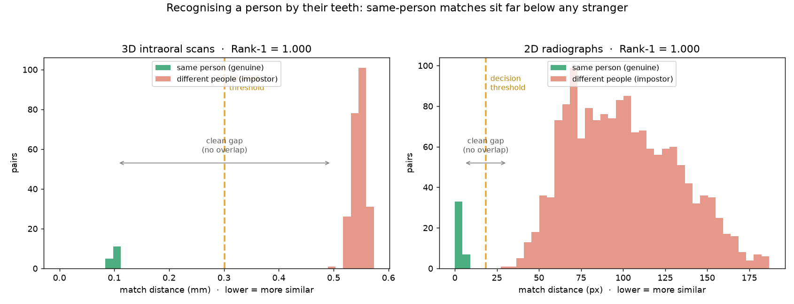
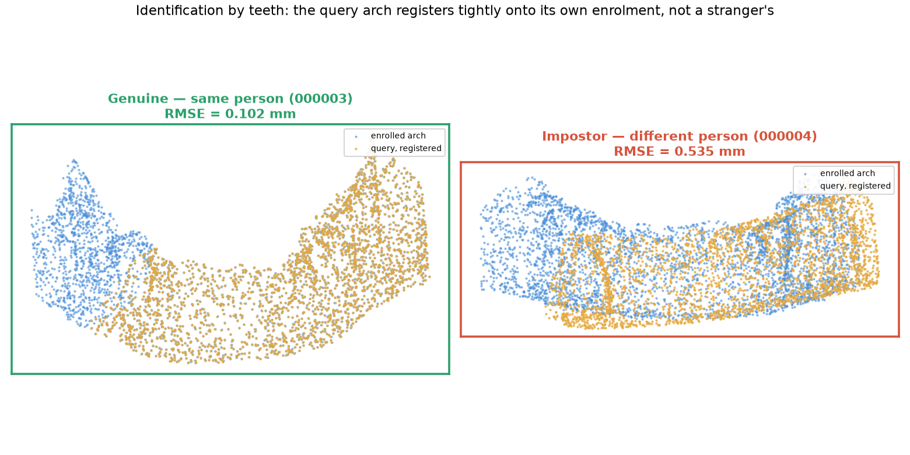
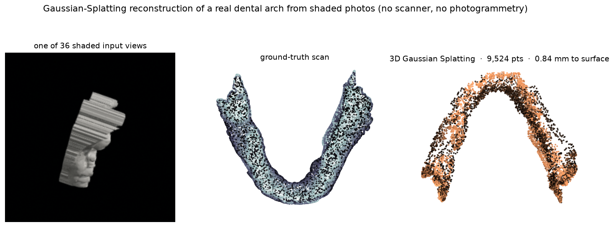
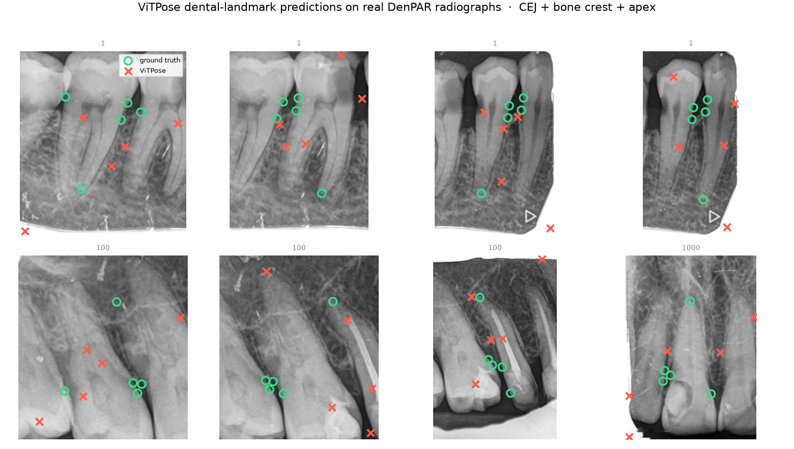

<div align="center">

# ToothPrint

**Certified dental-imaging intelligence — recognise a person by their teeth,
and certify what changed.**

`identity` · `change` · `surface` — three reads of one durable signal, each
returning a certificate instead of a guess.

</div>

---

A face can be lost; the teeth remain. ToothPrint reads the dentition three ways
and attaches a statistical guarantee to every verdict:

- **Who** is this? — dental biometric identification from a 3D scan or a 2D radiograph.
- **Whether** it changed — certified longitudinal bone-level change detection.
- **What** its surface is — certified 3D surface-change mapping.

The certification core depends only on `numpy`, `scipy`, `opencv`, and `open3d`.
Learned front-ends (tooth detection, Gaussian-splatting reconstruction) are
pluggable and optional, so the guarantees run without a GPU.

## Results (measured on real public data)

| Capability | What it answers | Result |
|---|---|---|
| **Identity — 3D scans** | Who is this arch? | **Rank-1 1.000** (N=80, EER 0), genuine 0.10 mm vs impostor 0.55 mm |
| **Identity — 2D radiographs** | Who is this X-ray? | **Rank-1 1.000** (N=400, EER 0), robust to 20 px jitter (0.985) & 50% magnification |
| **Change certificate** | Did the bone level change? | measurement recall **0.98 @ 0% false-progression**; **0.81 end-to-end** (detector-limited) |
| **Surface certificate** | Did the 3D surface change? | **localized** change recall **0.99** (global avg gets 0.00), usable to **0.4 mm** recon noise, **0% false-change** |



Every certificate is conformal: it fires only when the interval around the
measurement lies entirely past the threshold, so the false-alarm rate is bounded
by α in finite samples — no distributional assumptions.

## Evidence on real data

These are the system's own outputs on the public Poseidon3D and DenPAR datasets.

**Identification** — a query arch registers tightly onto its own enrolment
(0.10 mm) but cannot match a stranger's (0.54 mm). Recognition by teeth:



**Photos to geometry** — no scanner? **3D Gaussian Splatting** rebuilds a real
arch from shaded photos to within **0.84 mm** of the ground-truth scan (on an
8 GB GPU). Shading turns the textureless surface into the photometric signal that
photogrammetry can't find:



**Tooth localization** — ViTPose coarsely localises CEJ and bone crest on real
radiographs (GT green, prediction red). Pinpoint accuracy isn't required: the
change certificate measures the shift by sub-pixel registration, not by these
points:



**Change certificate** — measuring the bone-level shift *differentially* (sub-pixel
registration of the margin between timepoints, not by re-detecting landmarks) is
near-perfect: recall climbs to **1.0** with false-progression conformally bounded,
and still holds **0.98** even when the threshold is set so false-progression is a
true **0**. The only gap is the fully-automatic pipeline, where the detector's
coarse localization attenuates the signal — an honest, isolated, data-label limit,
not a flaw in the certificate:


**Surface certificate** — the displacement is measured *differentially* and
**de-biased** (the naive mean-of-distances rectifies reconstruction noise into a
false signal; subtracting the noise power removes it), which extends the usable
reconstruction noise from 0.1 mm to **0.4 mm**. It is also **regional**: a real
lesion moves a *patch*, which a whole-surface average dilutes to nothing (recall
**0.00**) — a per-region max statistic recovers it (**0.99**) and says *where* it
is, with the conformal false-change rate still **0** (the max is calibrated on
stable pairs). The honest residuals are shown too — heavy correlated noise still
costs small changes, and an 0.84 mm photo-reconstruction is too noisy for a 1 mm
global change:


## How it works

One stack, three certificates:

```
scan / radiograph ─▶ detect ─▶ register ─▶ certify
                     teeth +    2D/3D ICP ·  conformal interval ─▶ identity
                     landmarks  FPFH ·        ─▶ change
                     or cloud   template      ─▶ surface
                                matching
```

- **Identity (3D):** FPFH descriptors → coarse RANSAC → fine ICP → the gallery
  arch with the smallest registration RMSE is the person.
- **Identity (2D):** the per-tooth landmark constellation, scale-normalised so
  magnification cancels, aligned by rigid ICP.
- **Change:** the bone-level shift is measured *differentially* — sub-pixel
  template matching of the margin between timepoints, referenced to **multiple
  stationary crown anchors fitted to an affine motion model** so acquisition
  repositioning (translation, rotation, *and* projection magnification) cancels —
  then certified conformally.
- **Surface:** scale-aware ICP + screened-Poisson refinement, then a *de-biased*
  differential displacement (subtract the reconstruction-noise power so zero-mean
  noise isn't rectified into a false signal), measured *per region* so a localized
  lesion isn't diluted — the max region is certified conformally (calibrated on the
  max, so the false-change rate stays bounded) and tells you where it changed.

## Use it

```python
import numpy as np
from toothprint.identity import enroll, identify_scan, identification_metrics
from toothprint.change import ConformalCertifier, certify_change, bone_vector
from toothprint.surface import surface_error, certify_surface_change

# Identify a person from a 3D arch against a gallery
gallery = [enroll(points, voxel_size=0.5) for points in enrolled_scans]
rmse_row = identify_scan(query_points, gallery, voxel_size=0.5)
person = labels[int(np.argmin(rmse_row))]

# Certify a surface change against calibrated reconstruction noise
certifier = ConformalCertifier.fit(measured_stable, true_stable, alpha=0.1)
verdict = certify_surface_change(measured_mm=1.2, certifier=certifier)   # -> "changed"
```

## Run the app

A web console for the three certificates, plus a JSON API.

```bash
pip install -e ".[api]"
uvicorn api.main:app --reload      # http://localhost:8000
```

| Endpoint | Does |
|---|---|
| `POST /api/identify/radiograph` | Match a landmark constellation against a gallery |
| `POST /api/certify/change` | Certify a radiograph bone-level change |
| `POST /api/certify/surface` | Certify a 3D surface change |

The frontend (`web/`) is a static, dependency-free single page — open it directly
or let the API serve it.

## Layout

```
toothprint/
  toothprint/        the library — identity · change · surface (100% covered)
  api/               FastAPI service
  web/               the console (HTML/CSS/JS, no build step)
  docs/              result figures
  tests/             97 tests, 100% coverage
```

## Test

```bash
pip install -e ".[dev]"
pytest --cov=toothprint --cov=api      # 100%
```

## Clinical deployment & readiness

ToothPrint is a **validated research prototype, not a cleared medical device.** A
`toothprint.clinical` layer provides the deployment-engineering a clinical
setting needs — **site recalibration** of the conformal layer (the α guarantee
only transfers if you recalibrate on your own data), **input quality gates**
(refuse unusable captures), **first-class abstention**, and an **append-only
audit trail**. Governance docs spell out the rest honestly:

- [MODEL_CARD.md](MODEL_CARD.md) — intended use, out-of-scope use, performance, ethics
- [RISK.md](RISK.md) — ISO 14971-style hazard analysis
- [CLINICAL_READINESS.md](CLINICAL_READINESS.md) — what is done vs the regulatory gate
- [evaluation/REPORT.md](evaluation/REPORT.md) — full ablated evaluation + verdict

**Bottom line:** the methods are sound and the false-alarm guarantee is real, but
real-world clinical use still requires longitudinal/cross-session data, a
prospective study, and FDA/CE clearance — none of which can be produced from code.

## Provenance & limits

Numbers are measured on the public Poseidon3D (intraoral scans) and DenPAR
(radiographs) datasets with **synthetic** perturbations (single-timepoint data —
read the headline metrics as optimistic ceilings); reproduction scripts and the
underlying research live in the companion repositories. Datasets and model
checkpoints are never committed.

## License

MIT.
