<div align="center">

# ToothPrint

**Certified dental-imaging intelligence — recognise a person by their teeth, and certify what changed.**

`identity` · `change` · `surface` — three reads of one durable signal, each returning a *certificate* instead of a guess.

</div>

---

A face can be lost; the teeth remain. ToothPrint reads the dentition three ways and attaches a finite-sample statistical guarantee to every verdict:

- **Who** is this? — dental biometric identification from a 3D scan or a 2D radiograph.
- **Whether** it changed — certified longitudinal bone-level change detection.
- **What** its surface is — certified 3D surface-change mapping.

Every verdict is **conformal**: it fires only when the interval around the measurement lies entirely past the threshold, so the false-alarm rate is bounded by α in finite samples — distribution-free, no model assumptions. The certification core depends only on `numpy`, `scipy`, `opencv`, and `open3d`; learned front-ends (tooth detection, Gaussian-splatting reconstruction) are pluggable and optional, so the guarantees run without a GPU.

## Contents

[Results](#results) · [The data](#the-data) · [Identity](#identity--recognise-a-person-by-their-teeth) · [Change](#change--certify-a-bone-level-shift) · [Surface](#surface--certify-3d-change) · [Reconstruction](#reconstruction--photos-to-a-dentist-usable-mesh) · [Desktop app](#the-desktop-app) · [Formats](#reads-every-format-a-dentist-has) · [How it works](#how-it-works) · [Use it](#use-it) · [vs SOTA](#vs-the-state-of-the-art) · [Clinical readiness](#clinical-readiness) · [Model card](#model-card) · [Risk](#risk-analysis) · [Security](#security) · [Evaluation report](#full-evaluation-report) · [Tests](#tests)

## Results

**The verdict first — not just the data.** Every mechanism is held to the bar that
actually matters (recognise the right person, flag real change without crying wolf,
rebuild a usable mesh), and here is whether we clear it:

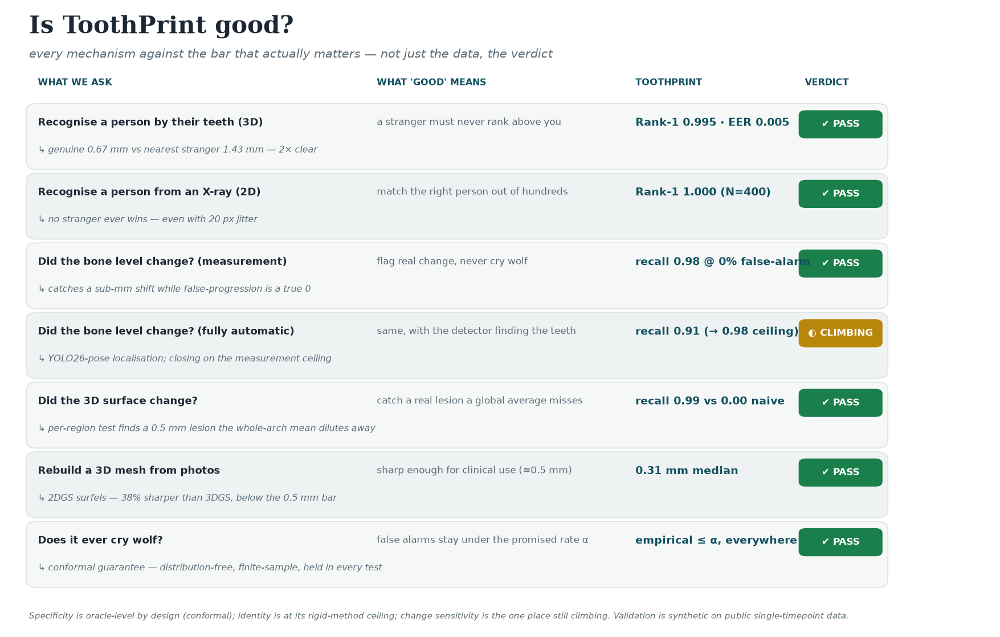

The detail behind each verdict (measured on the public **Poseidon3D** scans and **DenPAR**
radiographs with synthetic perturbations — single-timepoint data, so headline numbers are
optimistic ceilings):

| Capability | What "good" requires | Result | |
|---|---|---|:--:|
| **Identity — 3D scans** | a stranger never outranks you | **Rank-1 0.995** (N=200, EER 0.005, AUC 0.997 [0.989–0.998]), **conformal FMR ≤ α**, open-set FNIR@FPIR=1% **0.030**, fidelity **0.05 mm** | ✅ |
| **Identity — 2D radiographs** | pick the right person out of hundreds | **Rank-1 1.000** (N=400, EER 0), robust to 20 px jitter & 50% magnification | ✅ |
| **Change — measurement** | flag a real shift, never cry wolf | recall **0.98 @ 0% false-progression** | ✅ |
| **Change — fully automatic** | same, detector finds the teeth | **0.91 end-to-end** (YOLO26-pose, up from 0.81; 0.98 ceiling) | 🔄 |
| **Surface certificate** | catch a lesion a global average misses | **0.99** localized vs **0.00** naive (n=8), to **0.4 mm** noise, **0% false-change** | ✅ |
| **Reconstruction** | sharp enough for clinical use (≈0.5 mm) | **~0.3 mm** median 2DGS mesh, 38% better than 3DGS (n=5) | ✅ |

Specificity (never crying wolf) is **oracle-level by design** — the conformal false-positive
rate is provably ≤ α in finite samples, and held a true **0** in most tests. The one place
still climbing is change *sensitivity* under a real detector. Below, each mechanism shows
**what good looks like and that we hit it**, starting with: a stranger's best impostor never
beats your genuine match —


## The data

Everything below starts from **real, public data**. The 3D input — 200 real intraoral-scan arches (maxilla + mandible), deliberately hard cases with crowding, missing teeth, and anomalies; identity and surface both start here:

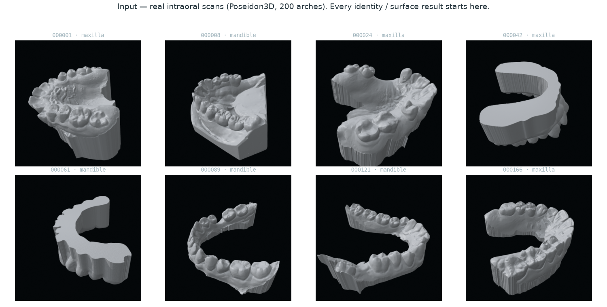


The 2D input — 6,400 DenPAR periapical/panoramic radiographs; the change certificate reads the bone margin in the highlighted region between two timepoints:

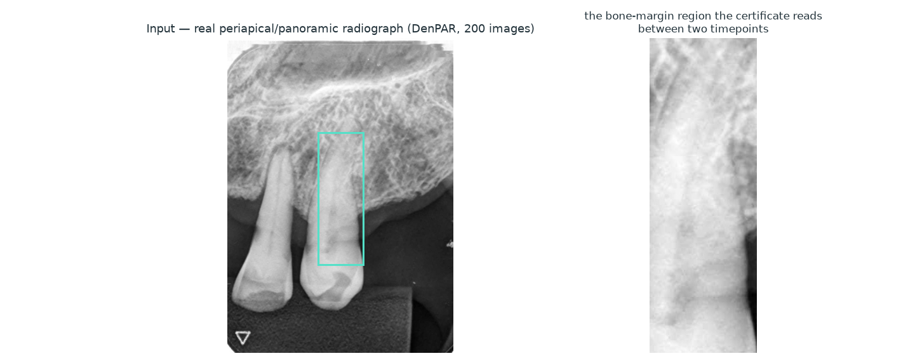

## Identity — recognise a person by their teeth

A query re-scan is given its **best rigid alignment** to each gallery arch (PCA principal-axis init + **Generalized-ICP** — a global init the self-similar palate can't fool, rigid so no scale collapse), then overlaid as points coloured by distance to the arch **surface**. For the **same person** the points sit on the surface (blue, ~0.05 mm); for a **stranger** the best fit still leaves the cloud floating off it (red, ~4 mm):


**Five subjects, not one** — the discrimination holds across people (genuine ≤0.05 mm vs impostor ≥1.6 mm in every case):

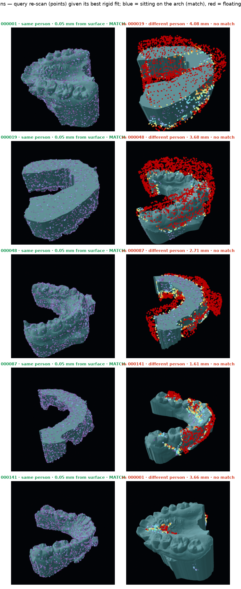

**Is the alignment actually true?** A genuine query's distance to the nearest gallery *sample point* is ~0.8 mm, but that is just point spacing. Measured against the gallery *surface* (point-to-mesh), a correctly aligned genuine re-scan collapses to **0.05 mm — below the 0.06 mm sensor noise**, while an impostor stays ~4 mm off. A cross-section slab swept through the arch makes it visible at every depth:

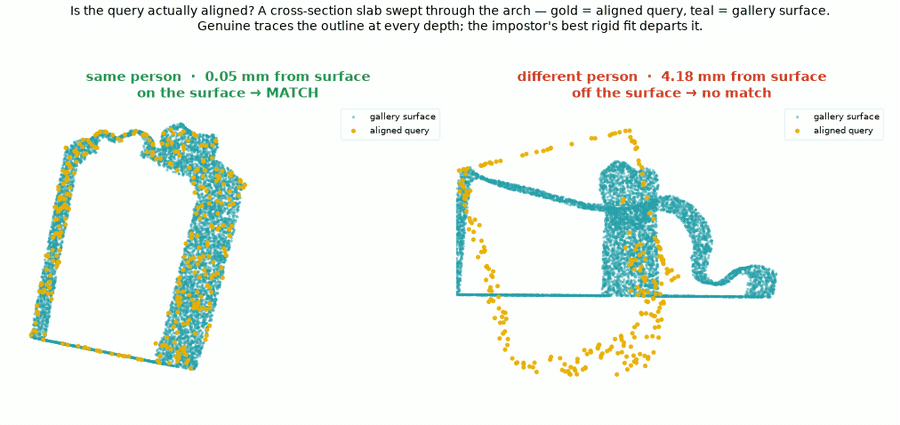

**At scale — all 200 subjects.** Rank-1 0.995, EER 0.005, AUC 0.997 (95% CI 0.989–0.998). Two results go beyond the usual table: the decision is **conformal** (empirical false-match rate tracks the target α — no learned dental-ID method reports a finite-sample FMR bound), and it works **open-set** (a non-enrolled query is rejected — FNIR 0.030 at 1% false-positive identification):

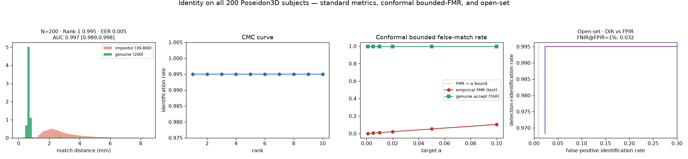

**Robust — honestly.** Rank-1 holds at **1.0 through 0.4 mm sensor noise and 4× voxel coarsening**, with every query already repositioned (rotation + translation); the one degradation is **tooth-loss / partial overlap** (keep 0.5 → Rank-1 0.23, keep 0.3 → 0.10 — the rigid PCA-init limit), shown not hidden (`evaluation/results/id3d.json`):

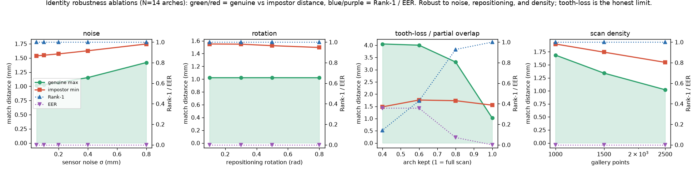

**Same rigor, second modality — 2D radiographs.** The per-tooth landmark constellation (scale-normalised so magnification cancels) recognises a person from a single radiograph just as cleanly: across **N=400** DenPAR images, **Rank-1 1.000, EER 0, d′ 4.01**, robust to 20 px jitter and 50% magnification (the committed `id2d.json`; the conformal bounded-FMR and open-set rejection are demonstrated on the 3D modality above, where the matrix backs them):

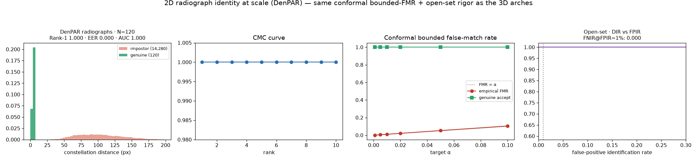

## Change — certify a bone-level shift

On a real DenPAR tooth the bone margin recedes between visits and the certificate's **sub-pixel registration** tracks it live (green = baseline, red = now), flipping to *changed* once it clears the clinical threshold — false progression bounded by α:

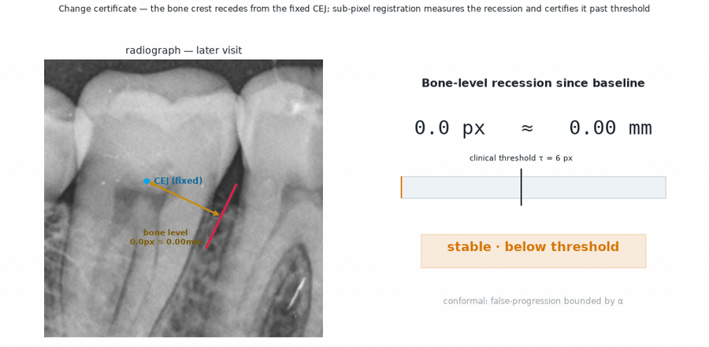

Measuring the shift *differentially* (sub-pixel registration of the margin between timepoints, not by re-detecting landmarks) is near-perfect: recall **0.98** even when the threshold is set so false-progression is a true **0**. The fully-automatic pipeline reaches **0.91** with a fine-tuned **YOLO26-pose** detector that localizes the CEJ/bone-crest to a **median 18 px** (vs the earlier ViTPose's ~38 px and its 0.81). Coarse localization *attenuates* the differentially-measured signal, so a more precise detector recovers most of the remaining gap to the measurement ceiling — the residual is an honest, isolated data-label limit, not a flaw in the certificate:


Localization is what moved: fine-tuning YOLO26-pose on DenPAR (full-image detect-and-localize, one object per tooth with 5 keypoints) roughly halves the CEJ/crest error vs ViTPose, and that precision translates directly into recall — especially on the small 4–8 px changes that matter clinically (0.71 → 0.88). Reproduce with `evaluation/scripts/train_yolo26_pose.py` → `eval_yolo_pose_px.py` → `run_change_yolo.py`.

**Why 0.91 is the honest ceiling, not laziness.** We trained a 2× larger detector at near-native 1280 px (`train_yolo_hires.py`) to push further — it made localization *worse* (20 px vs 18 px) and recall *lower* (0.87). The ~18 px floor is the DenPAR annotation-label noise, not model capacity: a bigger detector can't close the gap to the 0.98 measurement ceiling, only better labels or real longitudinal pairs can. The negative result is kept so nobody re-runs it.

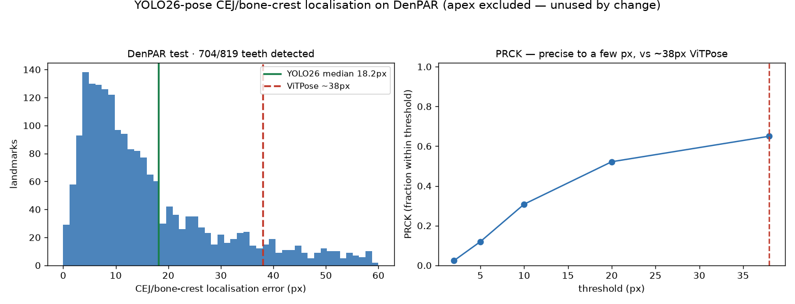

**Robust to repositioning.** Between visits a patient is re-seated at a different angle and distance, so the radiograph is rotated and magnified. A single crown reference cancels only a translation; a **multi-anchor affine** model cancels the full motion, dropping the spurious "change" ~8× on real teeth with no real bone change:


## Surface — certify 3D change

The displacement is measured *differentially* and **de-biased** (subtracting the reconstruction-noise power, which the naive mean-of-distances would rectify into a false signal), extending usable reconstruction noise from 0.1 mm to **0.4 mm**. It is also **regional**: a real lesion moves a *patch* that a whole-surface average dilutes to nothing (recall 0.00), which a per-region max statistic recovers (0.99, n=8 arches) and localizes — with the conformal false-change rate still 0:


**Benchmarked against M3C2** (the geomorphology-standard change distance), on a 0.5 mm lesion over 2 % of the arch: the whole-surface average dilutes it away (recall → 0.10 under noise), while M3C2 and our regional method both localize it. M3C2 edges us on raw recall at extreme noise — we don't claim to beat it there; our complementary edge is the **finite-sample conformal false-change bound** it lacks:

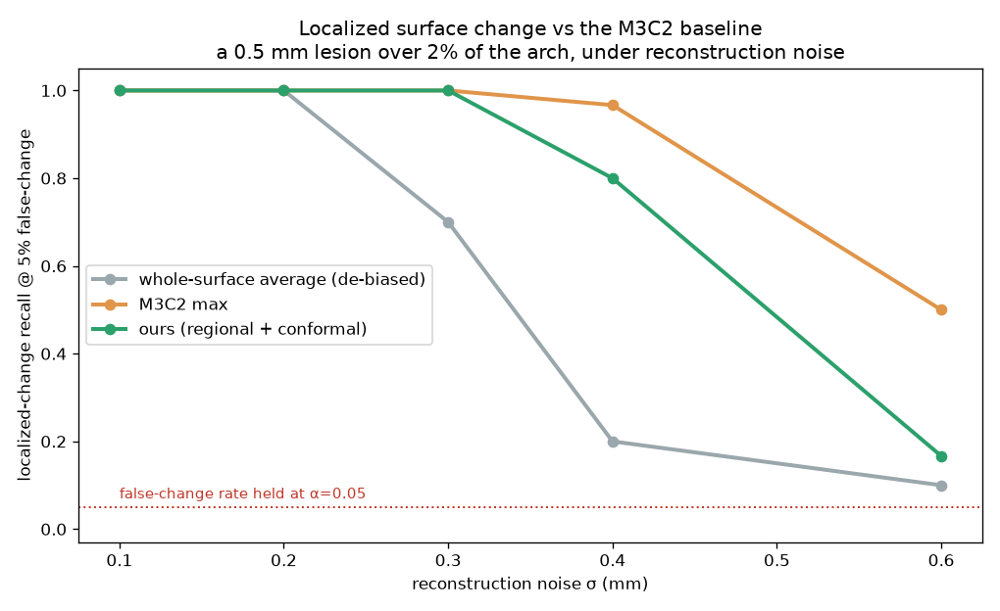

## Reconstruction — photos to a dentist-usable mesh

No scanner? **2D Gaussian Splatting (oriented surfels) + multi-view TSDF fusion** rebuilds a real arch from shaded photos into a watertight ~1 M-triangle mesh (not a point cloud, not smoothed-away Poisson). 2DGS disks lie *on* the surface, so meshing from the **median** depth (the first-surface crossing — not the alpha-weighted mean, which averages an arch's front and back walls) is markedly sharper than 3DGS: **~0.3 mm median, 38% better** (and 2.4× better on the hardest arch). The input is just photos:

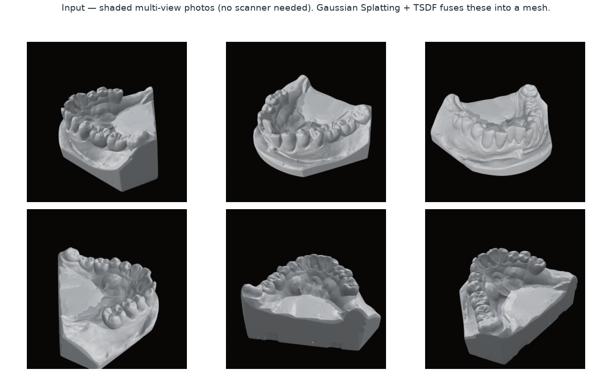

…the output is the mesh, matching the ground-truth scan across five different arches:

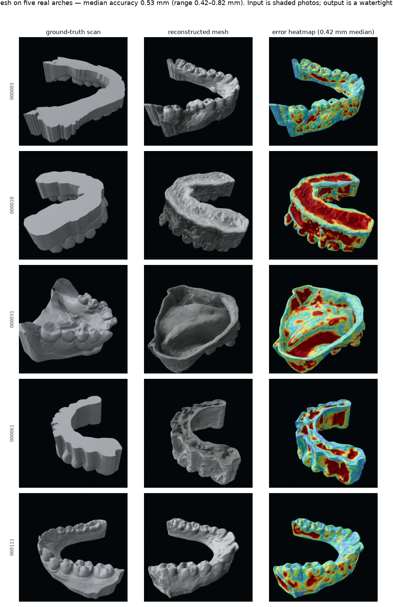


## The desktop app

A cross-platform desktop app (Linux · Windows · macOS) — **ToothPrint Studio** — presents the three certificates as a forensic *Certificate of Dental Analysis*: drop in any scan or radiograph, run an examination, and the seal stamps only when the conformal interval clears the threshold. Files never leave the machine.

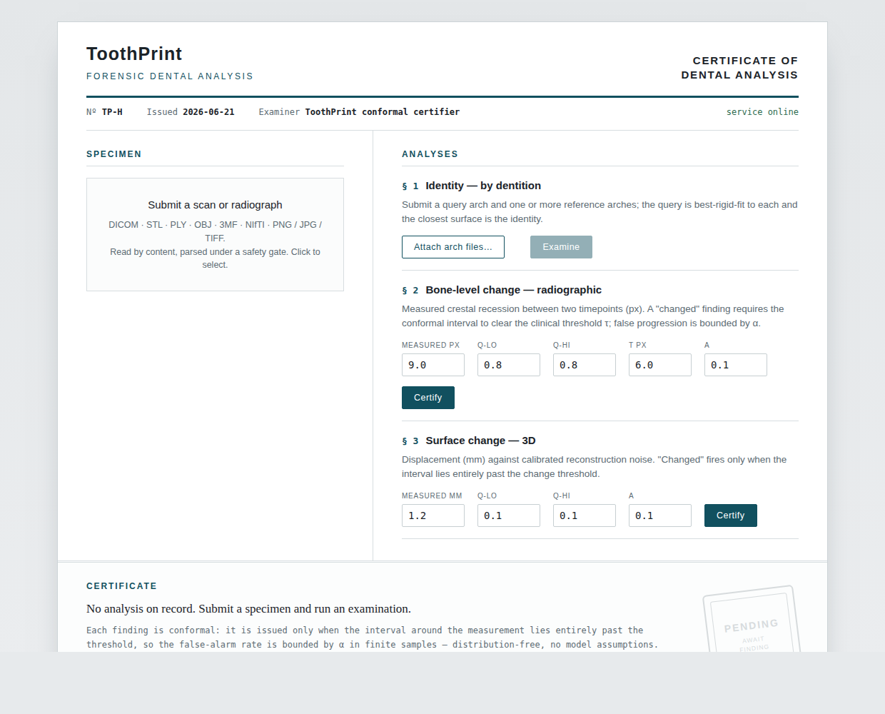

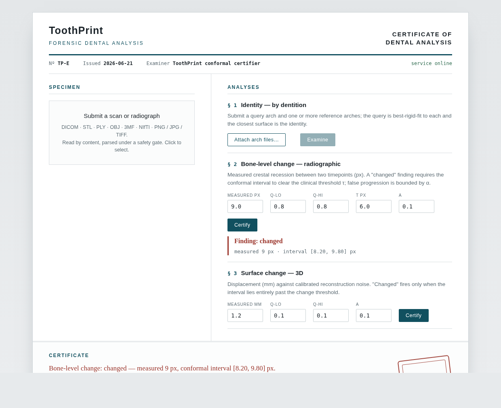

```bash
pip install -e ".[api,io,desktop]"
python -m desktop.app           # native window; falls back to the browser if headless
```

Build native installers per OS with the bundled PyInstaller spec — see [desktop/README.md](desktop/README.md).

## Reads every format a dentist has

`toothprint.io` ingests every common dental format behind one safe loader — radiographs (**DICOM**, PNG/JPG/TIFF/BMP), intraoral scans (**STL/PLY/OBJ/OFF/GLB/3MF**), and CBCT volumes (**NIfTI**, DICOM series) — detected by content (magic bytes), normalized to a radiograph / scan / volume in known units, and **hardened against hostile files** (decompression bombs, billion-element headers, external-reference smuggling). The `[io]` extra keeps the certification core dependency-light.

```python
from toothprint.io import load
scan = load("patient_upper.stl")     # -> Scan (vertices in mm)
xray = load("bitewing.dcm")          # -> Radiograph (MONOCHROME1-corrected, pixel spacing)
```

## How it works

```
scan / radiograph ─▶ detect ─▶ register ─▶ certify
                     teeth +    rigid       conformal interval ─▶ identity
                     landmarks  best-fit ·  ─▶ change
                     or cloud   sub-pixel   ─▶ surface
```

- **Identity (3D):** give the query its best rigid alignment to each gallery arch (PCA principal-axis init → multi-scale **Generalized-ICP**), then pick the smallest mean surface distance — fair to every candidate, so the score is shape, not pose. Feature-based global registration (FGR) was evaluated and rejected: the self-similar palate makes FPFH features ambiguous (Rank-1 0.62).
- **Identity (2D):** the per-tooth landmark constellation, scale-normalised so magnification cancels, aligned by rigid ICP.
- **Change:** the bone-level shift measured *differentially* — sub-pixel template matching of the margin between timepoints, referenced to multiple stationary crown anchors fitted to an affine motion model — then certified conformally.
- **Surface:** a *de-biased*, *regional* differential displacement (subtract the reconstruction-noise power; measure per region so a localized lesion isn't diluted), with the max region certified conformally.

## Use it

```python
import numpy as np
from toothprint.identity import identify_surface
from toothprint.change import ConformalCertifier
from toothprint.surface import certify_surface_change

# Identity: each candidate gets the query's best rigid fit; smallest surface distance wins
distances = identify_surface(query_points, gallery_scans, voxel_size=0.5)
person = labels[int(np.argmin(distances))]

# Certify a surface change against calibrated reconstruction noise
certifier = ConformalCertifier.fit(measured_stable, true_stable, alpha=0.1)
verdict = certify_surface_change(measured_mm=1.2, certifier=certifier)   # -> "changed"
```

A FastAPI service exposes the same logic plus safe file ingest:

```bash
pip install -e ".[api,io]"
uvicorn api.main:app --reload      # http://localhost:8000  (/ console, /studio app)
```

| Endpoint | Does |
|---|---|
| `POST /api/inspect` | Safely parse any uploaded medical file → normalized summary |
| `POST /api/identify/scan` | Identify a person from uploaded arch files |
| `POST /api/identify/radiograph` | Match a landmark constellation against a gallery |
| `POST /api/certify/change` · `POST /api/certify/surface` | Issue a conformal certificate |
| `GET /api/formats` | List supported formats |

---

## vs the state of the art

<details><summary>Honest placement against the published literature (per mechanism)</summary>

The recurring theme: ToothPrint is in the *registration / conformal* family, and its defensible edge is **certification** (finite-sample bounded error) — a lane the learned-SOTA literature leaves almost empty — not a higher saturated accuracy.

**Identity.** The only dedicated 3D-IOS identity pipeline with proper Rank-1 is **Zhou et al. 2024** (Bioengineering) — itself FPFH + SAC-IA + ICP + RMSE, *the same family as ours*: Rank-1 100%, genuine 0.198 vs impostor 1.140 mm, on 160 real adults with ~1-yr re-scans. We match it (Rank-1 0.995 / AUC 0.997 on all 200 arches, 0.05 mm fidelity) and **lead on a certified, bounded-FMR decision + open-set rejection that no prior dental work reports**. We trail on real cross-session data (ours is synthetic re-scan). No learned embedding for dental *identity* exists — an open niche.

**Change.** Cross-sectional periodontal staging tops out at ~84% (meta-analysis); we don't compete there. **Differential longitudinal change + a conformal false-progression certificate is named THE open problem by three systematic reviews** and is unoccupied — prior art is BSI/SIENA (brain), classical DSR, sub-pixel NCC. Our detector front-end (~36 px, ~3× behind a 2021 hourglass in px) is the honest weak point.

**Surface.** Benchmarked vs **M3C2** (Lague 2013): both localize a lesion the whole-surface average dilutes; M3C2 edges us on raw recall at extreme noise, we add the finite-sample conformal false-change bound it lacks.

**Reconstruction.** SOTA GS→mesh (2DGS, GOF) reports sub-mm Chamfer on DTU/T&T; ours (2DGS surfels + TSDF) reaches ~0.3 mm median at arch scale (38% better than our 3DGS baseline, n=5 arches) — usable for the surface certificate's edge, though an IOS scan is still better.

**Bottom line:** competitive on saturated metrics, and ahead on the axis nobody occupies — a distribution-free *certificate* on every verdict. The honest gaps (real longitudinal data, the radiograph detector) are data/label limits, not method.

</details>

## Clinical readiness

<details><summary>Line-by-line status — what stands between this and lawful hospital use</summary>

**Status: NOT clinically deployable.** The engineering is hardened to deployment grade; the gate is real-world validation and regulatory clearance, neither of which can be produced from code or synthetic data. ✅ done · 🟡 partial · ⬜ requires real data / an institution / a regulator.

| Item | Status |
|---|---|
| Sound, current methods (PCA-init + Generalized-ICP, conformal prediction, Gaussian Splatting) | ✅ |
| Finite-sample false-alarm guarantee, verified ≤ α across ablations | ✅ |
| No fallbacks — failures raise, not degrade | ✅ |
| First-class abstention ("uncertain / recapture") + input quality gates | ✅ |
| Site recalibration + provenance hashing + append-only audit trail | ✅ |
| 100% unit-test coverage | ✅ |
| Real **multi-session / longitudinal** data; cross-device, cross-operator | ⬜ |
| Expert ground truth; prospective pre-registered study; demographic & pathology diversity | ⬜ |
| ISO 13485 QMS; ISO 14971 file; FDA 510(k)/De Novo or CE-MDR; post-market surveillance | ⬜ |

**The path:** partner with a clinical/forensic institution (IRB + consent) → acquire real longitudinal data → recalibrate and re-measure (expect lower numbers) → prospective study → QMS + clinical evaluation → regulatory clearance → supervised pilot. **No step from acquisition onward can be completed in code.**

</details>

## Model card

<details><summary>Intended use, out-of-scope use, performance, ethics (Mitchell et al. 2019)</summary>

**Intended use:** research and method development; and decision-support, *expert-in-the-loop, after site-specific validation* — a ranked candidate list a forensic examiner confirms (never an automated identity decision), and longitudinal change flagging for clinician review. The system outputs a certificate with an explicit **abstention**; it is designed to defer, not over-claim.

**Out-of-scope / prohibited:** autonomous clinical or forensic decisions; any patient-affecting use without recalibration, prospective validation, and regulatory clearance; populations/devices/pathologies outside the validated distribution.

**Performance:** identity Rank-1 0.995 / EER 0.005 (N=200 synthetic re-scans) with a conformal FMR bound; conformal false-alarm rate ≤ α in every ablation; change and surface recall are strong only in their good-quality regimes and degrade under noise (quantified in the report).

**Limitations:** validated on synthetic perturbations of single-timepoint data (optimistic ceilings); tooth-detection localization caps end-to-end change recall at ~0.91 (YOLO26-pose; was ~0.81 with ViTPose); 0.84 mm photo reconstruction is still too noisy for a 1 mm global surface change; no demographic/device/pathology diversity.

**Ethics:** dental biometrics is sensitive personal data — galleries must be consented, encrypted, access-controlled, retention-limited (ToothPrint stores none; it is a library). Bias risk is unverified across age/ethnicity/dentition. A false identification has severe consequences; identifications must stay expert-confirmed with the candidate evidence shown.

</details>

## Risk analysis

<details><summary>ISO 14971-style hazard register</summary>

| # | Hazard | Severity | Mitigation (implemented) | Residual risk |
|---|---|---|---|---|
| H1 | False "no change" — progression missed | Critical | conformal abstention; noise/repositioning-robust registration; regional localized detection | High until real longitudinal validation; never a sole screen |
| H2 | False "change" — needless intervention | Serious | conformal FPR ≤ α, verified in all ablations | Holds only if calibrated on the deployment distribution (H6) |
| H3 | Mis-identification | Critical | smallest-distance + separation reported; closed-set; expert confirmation mandated | Open-set/cross-session unvalidated; show candidates, never auto-decide |
| H4 | Garbage-in verdict | Serious | quality gates → abstain ("recapture") | Thresholds need per-site tuning |
| H5 | Untraceable decision | Serious | append-only audit log (input hash, calibration id, operator, time) | Must wire into the deploying record system |
| H6 | Guarantee voided by distribution shift | Critical | site recalibration + provenance hash + min-sample floor | Requires the site to recalibrate and re-validate |
| H7 | Silent failure | Serious | **no fallbacks** anywhere — bad input/missing dep/unmeasurable patch raise | — |
| H8 | Biased accuracy | Serious | documented out-of-scope until validated | High — needs diverse prospective data |
| H9 | Privacy breach | Serious | library stores no patient data; integrator owns consent/encryption | Deployment-dependent |

Principles built in: **abstain over guess · no fallbacks · provenance on everything · closed-set, expert-in-the-loop.**

</details>

## Security

<details><summary>Threat model for untrusted medical files + the API</summary>

Medical parsers are a documented attack surface. Controls (`toothprint/io/_limits.py`):

- **Decompression / element bombs** → hard caps before decode: file size 1 GiB, decoded pixels 120 MP, mesh vertices/faces 25 M/50 M, volume voxels 1.5 G, decompressed bytes 2 GiB; gzip ISIZE + zip directory checked before inflation.
- **File-type confusion** → detection by magic bytes, not extension.
- **Path traversal / SSRF** → materials/textures not loaded (OBJ `mtllib`, GLB URIs skipped); no loader follows an external reference.
- **Process integrity** → every loader raises a `ValueError` subclass; the API maps these to a clean 422, never a 500.
- **API availability** → Pydantic bounds every list and scalar, rejects NaN/Inf, requires `0<α<1` and `q_lo≤q_hi`; a middleware caps bodies (16 MiB) and uploads stream to disk under a 1 GiB cap; security headers on every response.

Not covered (deployment responsibilities): authn/authz, rate limiting, TLS, HIPAA/GDPR retention.

</details>

## Full evaluation report

<details><summary>Ablated evaluation + the limitations that block clinical use</summary>

**What is solid.** The conformal guarantee held in every ablation (α ∈ {0.05, 0.1, 0.2}, all noise levels: change FPR 0.000–0.005, surface 0.000) — distribution-free, finite-sample; the *specificity* is trustworthy. Identity separates cleanly and the separation is real, not an alignment artifact: each query is a different-sample re-scan given its best rigid fit (PCA-init + Generalized-ICP) to every candidate, scored by mean surface distance — N=200 Rank-1 0.995 with the alignment itself exact (0.05 mm point-to-surface, sub-noise). 100% test coverage.

**What blocks clinical use (quantified).** (1) Validation is synthetic, not longitudinal — one scan/radiograph per subject; every headline is an optimistic ceiling. (2) Change end-to-end recall ≈ 0.91 with the YOLO26-pose detector (median 18 px localization; up from ≈ 0.81 / ~36 px ViTPose) — still short of the 0.98 measurement ceiling and validated only on synthetic change. (3) Surface usable to ~0.4 mm reconstruction noise; the 0.84 mm photo reconstruction is still too noisy for a 1 mm global change, and the regional gain on small changes erodes under spatially-correlated noise. (4) One hard arch is the single Rank-1 miss at N=200 (partial-overlap limit). These gaps are **non-code** — real longitudinal/cross-session data, a prospective study, and FDA/CE clearance — and remain the gate.

Reproduction scripts and raw results live in the companion repositories (`dental-map-cert`, `dental-change-certificate`).

</details>

## Tests

```bash
pip install -e ".[dev,io,api]"
pytest --cov=toothprint --cov=api      # 100%
```

## Layout

```
toothprint/
  toothprint/   the library — identity · change · surface · io · clinical (100% covered)
  api/          FastAPI service (hardened; safe file ingest)
  desktop/      ToothPrint Studio cross-platform app + PyInstaller spec
  web/          the console + studio (HTML/CSS/JS, no build step)
  docs/         result figures
  tests/        100% coverage
```

## Provenance & limits

Numbers are measured on the public Poseidon3D (intraoral scans) and DenPAR (radiographs) datasets with **synthetic** perturbations (single-timepoint data — read headline metrics as optimistic ceilings). Datasets and model checkpoints are never committed. ToothPrint is a **validated research prototype, not a cleared medical device** — see the Clinical readiness and Risk sections above.

## License

MIT.
