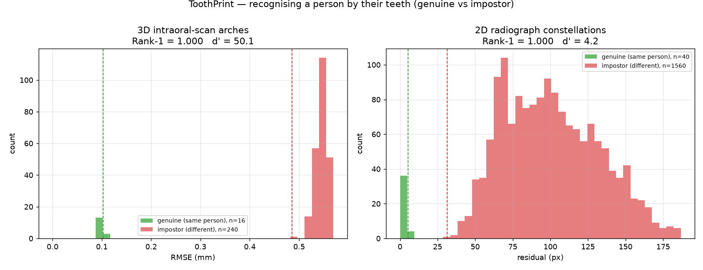

# ToothPrint

**A unified dental-imaging intelligence platform: certified change detection,
certified 3D surface mapping, and biometric identification — all from a person's
teeth.**

Teeth are individual, resilient, and information-rich. ToothPrint treats the
dentition as a *certified, identity-bearing signal* across two modalities — 2D
intraoral radiographs and 3D intraoral-scan surfaces — and unifies three
capabilities that were previously separate research projects:

| Pillar | Question | Result (real data) |
|---|---|---|
| **`identity/`** — dental biometrics | *Who is this?* | **Rank-1 = 1.000** (3D arches, d′=50; 2D constellations, d′=4.2) |
| **`change/`** — change certificate | *Did the bone level really change?* | recall **0.97 @ 0% FPR** (registration, accurate localization); **0.72 end-to-end** |
| **`surface/`** — surface certificate | *Did the 3D surface really change?* | certifies stable ≤0.2 mm / change ≥1.0 mm at **0% false-change** |

## Recognising a person by their teeth (`identity/`)

A person's dental arch is a biometric "tooth print". ToothPrint identifies them
two ways, both validated on real data with **100% Rank-1 accuracy**:



- **3D intraoral scans** (`toothid.mesh_id`): the SOTA registration pipeline —
  FPFH features → coarse RANSAC → fine ICP → the gallery arch with the **smallest
  registration RMSE** is the identity. On 16 real Poseidon3D arches (queried with
  synthesised noisy/partial re-scans): **Rank-1 1.000**, genuine RMSE 0.10 mm vs
  impostor 0.55 mm (zero overlap), decidability **d′ = 50**.
- **2D radiographs** (`toothid.landmark_id`): the per-tooth landmark
  *constellation* (CEJ, bone crest, apex) aligned with a scale-normalised rigid
  ICP; smallest residual wins. On 40 real DenPAR subjects (queried with
  acquisition reposition + magnification + jitter): **Rank-1 1.000**, genuine
  4.0 px vs impostor 102 px, **d′ = 4.2**.

```bash
python identity/scripts/run_mesh_identification.py --data surface/data/poseidon3d/extracted/data
python identity/scripts/run_landmark_identification.py --data change/data/denpar/extracted/Dataset
```

## Certified change detection (`change/`)

Certified longitudinal change detection in radiographs under acquisition
uncertainty: a **ViTPose** detector (37.8 px landmark error) localises teeth, a
**differential sub-pixel registration** measures the bone-level change (driving
stable-pair noise to ~0.1 px), and a **conformal certificate** decides — with a
guaranteed false-progression rate. Recall reaches **0.97 at 0% FPR** with
accurate localization (0.72 end-to-end with the detector). See
[change/README.md](change/README.md) and [change/RESULTS.md](change/RESULTS.md).

## Certified 3D surface mapping (`surface/`)

Certified surface-change detection from intraoral scans / multiview photos:
**DUSt3R** reconstruction (runs on an 8 GB GPU) + **screened-Poisson** refinement
(sub-mm denoising) feed a **conformal surface-change certificate** that certifies
stable surfaces (≤0.2 mm) and real change (≥1.0 mm) at a **0% false-change rate**.
See [surface/README.md](surface/README.md) and [surface/RESULTS.md](surface/RESULTS.md).

## Why one platform

The three pillars share the same primitives — landmark/surface detection,
registration (2D ICP, 3D scale-aware ICP, sub-pixel template matching), and
conformal calibration — applied to the same dentition. Identity, change, and
geometry are facets of one certified dental signal: *who* you are, *whether* your
teeth changed, and *what* their surface is.

## Layout

```
toothprint/
  identity/    dental biometric identification (3D meshes + 2D constellations)
  change/      certified radiograph change detection (ViTPose + registration + conformal)
  surface/     certified 3D surface mapping (DUSt3R + Poisson + conformal)
  docs/        result visuals
```

## Testing

```bash
cd identity && python -m pytest tests/ --cov=toothid          # 100% (standalone)
cd change   && python -m pytest tests/ --cov=dcc              # 100% with datasets present
cd surface  && python -m pytest tests/ --cov=dentalmapcert    # 100% with datasets present
```

`identity` is **100% covered standalone** (synthetic + small fixtures). `change`
and `surface` reach **100%** when their datasets are present; without the
(gitignored) datasets, their dataset-adapter/CLI integration tests skip, so a
bare checkout reports ~95–99%. Datasets and model checkpoints are gitignored; see
each pillar's docs for download instructions.
