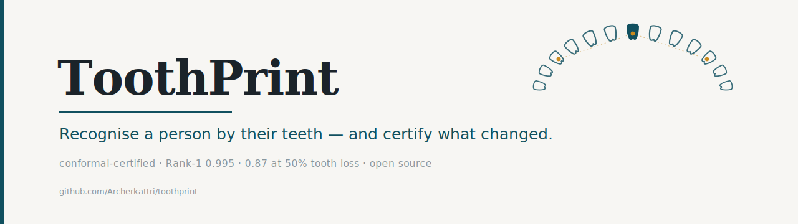
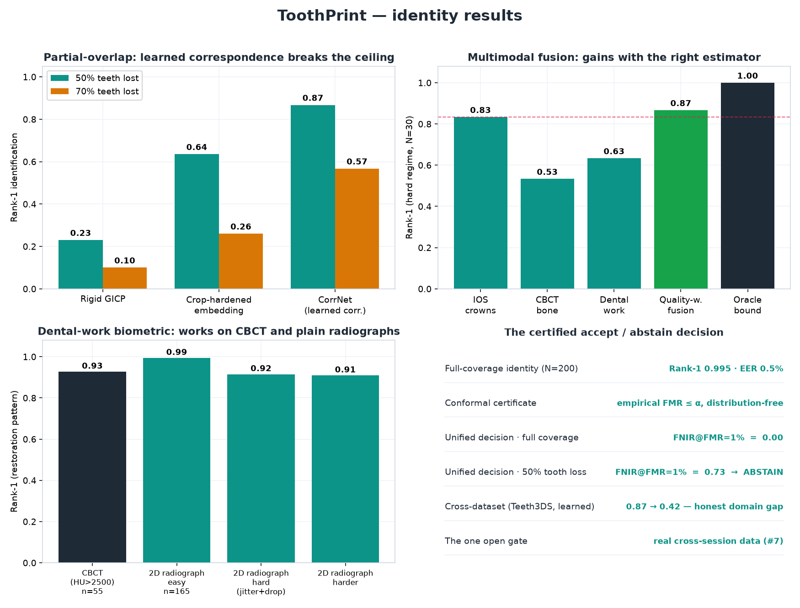
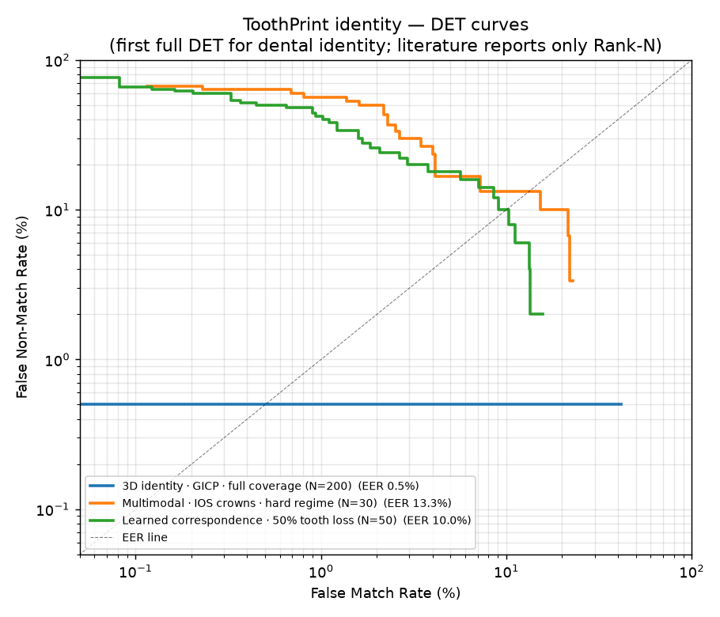

<div align="center">

[](https://github.com/Archerkattri/toothprint)

**`identity`** · **`change`** · **`surface`** — three reads of one durable signal, each returning a *certificate* instead of a guess.

[](https://engrxiv.org/preprint/view/7403)
[](https://doi.org/10.31224/7403)
[](LICENSE)
[](REPRODUCE.md)
[](#the-certificate)
[](#tests)

</div>

---

> **A face can be lost; the teeth remain.** ToothPrint turns dental scans, radiographs, and visit-to-visit records into evidence that can be checked: a match, a change finding, or a surface map, each with an explicit uncertainty certificate.

🔖 **[Preprint + DOI](https://doi.org/10.31224/7403)** · 🔁 **[Reproduce](REPRODUCE.md)** · 🔬 **[Full write-up](PAPER.md)** · ▶ **[30-second reel](docs/toothprint_showcase.mp4)** · 🖥️ **[Desktop app](#toothprint-studio)**

## Start here

| Need | ToothPrint returns | Primary viewer |
|---|---|---|
| **Is this the same person?** | a ranked dental match plus accept / abstain certificate | forensic examiner, dentist, researcher |
| **Did bone level change between visits?** | changed / stable / uncertain with a false-progression bound | dentist, periodontist, patient-facing report |
| **Where did the 3D surface change?** | regional surface-change map with a false-change bound | clinician, lab, reconstruction researcher |
| **Can I inspect files locally?** | safe ingest, local preview, API response, and PDF case report | hospital IT, engineer, reviewer |

Every verdict is **conformal**: it fires only when the interval around the measurement lies entirely past the threshold, so the false-alarm rate is bounded by **α** in finite samples. The certification core depends only on `numpy`, `scipy`, `opencv`, and `open3d`; learned front-ends (tooth detection, point-correspondence, Gaussian-splatting reconstruction) are pluggable and optional, so the guarantees run without a GPU.

## Current status

| What is ready | What is not claimed |
|---|---|
| Research code, API, Studio app, safe file ingest, report export, tests, smoke reproduction, and committed visual evidence. | Not an autonomous clinical or forensic decision system. Not cleared by any regulator. Not validated on real multi-visit deployment data yet. |
| Validated on public dental data, synthetic re-scans/crops, fixture-sized reproducibility tests, and selected cross-dataset probes. | Headline numbers are best read as in-simulation ceilings until a clinical/forensic partner supplies real cross-session longitudinal data. |
| Designed for expert-in-the-loop review: show the evidence, report uncertainty, abstain when outside the validated regime. | No patient-affecting use without site recalibration, prospective validation, governance, and regulatory clearance. |

## For different readers

| Reader | Start with | What matters |
|---|---|---|
| **Patient** | [What a result looks like](#what-a-result-looks-like), [Model card](#model-card) | local analysis, explicit uncertainty, no autonomous decisions |
| **Dentist / clinician** | [Change](#-change--certify-a-bone-level-shift), [ToothPrint Studio](#toothprint-studio) | visit-to-visit bone-level tracking, PDF report, limitations |
| **Hospital / lab** | [Current status](#current-status), [Security](#security), [Clinical readiness](#clinical-readiness) | local files, audit trail, parser hardening, validation gap |
| **Researcher** | [Results](#results), [vs SOTA](#vs-the-state-of-the-art), [Reproduce](#reproduce) | conformal certificates, benchmarks, ablations, datasets |
| **Engineer** | [Quick start](#quick-start), [Formats](#reads-every-format-a-dentist-has), [How it works](#how-it-works) | install, API endpoints, file loaders, tests |

### For patients

ToothPrint is designed to make dental evidence easier to review, not to make unattended decisions. A result should show what was compared, what changed or matched, how uncertain the finding is, and when the system abstained. Files can be processed locally; ToothPrint itself does not store a patient database.

### For dentists and clinical reviewers

The practical workflow is longitudinal: compare a current radiograph, scan, or reconstructed surface against a prior visit, then export a report that separates **changed**, **stable**, and **uncertain** findings. The important promise is not "AI says so" — it is a measurement with an uncertainty interval and a stated false-alarm bound.

### For hospitals, labs, and IT

The relevant surface is governance: local deployment, hardened parsers for untrusted medical files, explicit no-fallback behavior, provenance hashes, audit metadata, and a clear line between research validation and lawful clinical use. The code is ready to inspect; real deployment still requires site calibration, prospective validation, access control, and regulatory work.

### For researchers

The contribution is a dental-imaging benchmark scaffold around **conformal certificates**: 3D identity, partial-overlap correspondence, radiograph identity, dental-work identification, change certification, surface-change certification, and photo-to-mesh reconstruction. The README keeps the strong numbers and the negative results together so the limits are visible.

### For engineers

Use the package as a library, FastAPI service, or desktop Studio shell. The ingest layer detects files by content, streams uploads under caps, rejects hostile files cleanly, and exposes the same identity/change/surface primitives used by the tests and evaluation scripts.

## What a result looks like

1. Upload an intraoral scan, radiograph, CBCT-derived mesh, or patient video.
2. ToothPrint extracts the relevant dental geometry: landmarks, arch surface, restorations, or reconstructed mesh.
3. It compares against a reference, a gallery, or a prior visit.
4. It returns one of three clinical-style outcomes: **match / no confident match / abstain**, **changed / stable / uncertain**, or a **regional surface-change map**.
5. ToothPrint Studio exports a PDF case report with inputs, findings, method, provenance, and limitations.

## Visual tour

The top-level story is dental first, chart second:

<p align="center">
  
  
</p>

<p align="center">
  
</p>

<p align="center">
  
</p>

<p align="center">
  
  
</p>

## Quick start

```bash
pip install -e ".[dev,io,api,desktop]"
python -m pytest -q
TOOTHPRINT_FIXTURES=1 PYTHONPATH=. python evaluation/scripts/smoke_test.py
uvicorn api.main:app
```

```bash
python -m desktop.app           # native Studio window; falls back to browser if headless
```

> **Contents** — [Start here](#start-here) · [Status](#current-status) · [Readers](#for-different-readers) · [Visual tour](#visual-tour) · [Results](#results) · [Identity](#-identity--recognise-a-person-by-their-teeth) · [Change](#-change--certify-a-bone-level-shift) · [Surface](#-surface--certify-3d-change) · [Reconstruction](#-reconstruction--photos-to-a-dentist-usable-mesh) · [Studio](#toothprint-studio) · [Formats](#reads-every-format-a-dentist-has) · [How it works](#how-it-works) · [Clinical readiness](#clinical-readiness) · [Security](#security) · [Reproduce](#reproduce) · [Help wanted](#help-wanted--real-longitudinal-data)

## Results

**The verdict first — not just the data.** Every mechanism is held to the bar that actually matters (recognise the right person, flag real change without crying wolf, rebuild a usable mesh), and here is whether we clear it:

| Capability | What "good" requires | Result | |
|---|---|---|:--:|
| **Identity — 3D scans** | a stranger never outranks you | **Rank-1 0.995** (N=200, EER 0.005, AUC 0.997), conformal **FMR ≤ α**, open-set FNIR **0.030**, fidelity **0.05 mm** | ✅ |
| **Identity — partial overlap** | survive missing teeth | **Rank-1 0.87 at 50% tooth loss** (learned correspondence; ~3.8× rigid GICP's 0.23) | ✅ |
| **Identity — 2D radiographs** | pick the right person out of hundreds | **Rank-1 1.000** (N=400, EER 0), robust to jitter & magnification | ✅ |
| **Identity — certified decision** | one accept/abstain verdict, bounded FMR | unified **FNIR@FMR=1% 0.00** full-coverage; abstains under heavy tooth loss | ✅ |
| **Identity — dental work** | identify by the restoration pattern | **0.93 CBCT · 0.91–0.99 radiograph** (forensic chart; n=55 / 165) | ✅ |
| **Multimodal fusion** | combine independent biometrics | quality-weighted fusion improves Rank-1 in the hard regime (oracle bound 1.0, complementary) | ✅ |
| **Change — measurement** | flag a real shift while avoiding false progression | recall **0.98 @ 0% false-progression** | ✅ |
| **Change — fully automatic** | detector finds the teeth | **0.91 end-to-end** (YOLO26-pose; 0.98 ceiling) | 🔄 |
| **Surface certificate** | catch a lesion a global average misses | **0.99** localized vs **0.00** naive (n=8), to **0.4 mm** noise, **0% false-change** | ✅ |
| **Reconstruction** | sharp enough for certificate experiments (≈0.5 mm target) | **~0.3 mm** median 2DGS mesh, 38% better than 3DGS (n=5) | ✅ |
| **Cross-dataset generalization** | works on a second real dataset | Teeth3DS Rank-1 1.0 (registration); learned descriptors carry an honest domain gap (0.87→0.42) | 🔄 |

Specificity is the design target: the conformal false-positive rate is bounded by α in finite samples, and held a true **0** in most tests. *All identity numbers are measured on public single-timepoint scans with synthetic re-scans/crops, so read them as in-simulation ceilings — the one binding gate is [real cross-session data](#help-wanted--real-longitudinal-data).*

---

## 🪪 Identity — recognise a person by their teeth

ToothPrint identifies a person from the shape of their dental arch — at full coverage, **and** when half the teeth are missing, the case where every prior rigid method collapses. The four results that matter:



### Full coverage: a stranger never wins

A query re-scan is given its **best rigid alignment** to each gallery arch (PCA principal-axis init + multi-scale **Generalized-ICP** — a global init the self-similar palate can't fool, rigid so no scale collapse), then scored by distance to the arch **surface**. For the **same person** the cloud sits on the surface (~0.05 mm, below sensor noise); for a **stranger** the best fit still floats ~4 mm off.


The discrimination holds across people (genuine ≤ 0.05 mm vs impostor ≥ 1.6 mm in every case), and the alignment is *truly* exact — a swept cross-section shows the genuine cloud on the surface at every depth:


**At scale — all 200 subjects:** Rank-1 0.995, EER 0.005, AUC 0.997 (95% CI 0.989–0.998). And a **first for dental identity** — full Detection-Error-Tradeoff curves (the literature reports only Rank-N): full-coverage 3D sits at **EER 0.5%**, learned correspondence holds a real curve even at 50% tooth loss (EER 10%), and the degraded multimodal regime is drawn honestly (EER 13%).




### <a name="the-certificate"></a>The certificate — bounded false-match rate, hardened against look-alikes

Two results go beyond the usual table. The decision is **conformal** — empirical false-match rate tracks the target α; no learned dental-ID method reports a finite-sample FMR bound — and it works **open-set** (a non-enrolled query is rejected, FNIR 0.030 at 1% false-positive identification). The bound even **survives hard negatives**: re-calibrated against each subject's *nearest* impostor (the ~0.8 mm look-alike, not a random arch), empirical FMR still tracks α (0.016 at α=0.01) for a 1–4% genuine-accept cost. A literature FMR on random arches is easy; holding it against look-alikes is the honest test.

### The partial-overlap breakthrough — learned point correspondence

A query missing half its teeth is **the genuine open problem** in dental identity: rigid GICP collapses to Rank-1 0.23, because the PCA-init can't align a missing-teeth query. We solve it in two layers, ruling out the cheap fix first:

1. **Not the scoring** — robust statistics (trimmed mean, median, fitness) of a *wrong* alignment don't help (they tie or trail the plain mean). The bottleneck is the *descriptor*, not the score.
2. **Crop-hardening the embedding** — a DGCNN + sub-centre ArcFace encoder, re-trained on aggressive partial crops (keep ≥ 0.35), lifts keep-0.5 from 0.46 → **0.64** at *no* full-coverage cost. This raised the floor.
3. **CorrNet breaks the ceiling** — instead of one pooled descriptor, CorrNet emits a **unit descriptor per point** (InfoNCE correspondence loss; crops give ground-truth matches for free). A partial query is matched point-to-point against each gallery arch (mutual NN → weighted Procrustes), scored by the residual over *all* query points.

Under **realistic discrete whole-tooth dropout** (random, non-contiguous teeth removed — not a clean slice), on held-out **unseen** subjects:

| method | keep-0.5 | keep-0.3 (70% gone) |
|---|:--:|:--:|
| rigid GICP | 0.23 | 0.10 |
| crop-hardened embedding | 0.64 | 0.26 |
| **CorrNet (learned correspondence)** | **0.87** (AUC 0.98) | **0.57** (AUC 0.94) |

**The honesty checks that shaped these numbers** — both kept, both moved numbers down: a clean *planar* half-cut is easier (0.91 / 0.80), so the extreme figure was partly riding on crop geometry — the realistic dropout above is what we report. And an *untrained* CorrNet already scores **0.70** at keep-0.5, so the win is ~half the correspondence-plus-rigid-verification **architecture** (the right inductive bias) and ~half the **learned** descriptors.

**Cross-dataset honesty.** The learned descriptors are partly dataset-specific: CorrNet trained only on Poseidon3D, run on **Teeth3DS+** (a different real dataset, all unseen), drops keep-0.5 **0.87 → 0.42** — still 34× chance and still above GICP, but a real domain gap that needs multi-dataset training to close. Recorded, not hidden.

*Reproduce:* `train_correspondence.py` → `eval_correspondence.py` → `correspondence_identity.json`; cross-dataset in `eval_correspondence_teeth3ds.py`.

### Two more modalities, and a forensic signal

**2D radiographs — same rigor.** A per-tooth landmark constellation (scale-normalised so magnification cancels) recognises a person from a single radiograph: across **N=400** DenPAR images, **Rank-1 1.000, EER 0, d′ 4.01**, robust to 20 px jitter and 50% magnification.


**Multimodal fusion on real paired data.** On the Figshare CBCT+IOS set, every patient has three real biometrics — IOS **crowns**, CBCT **bone/root** geometry, CBCT **dental-work** pattern. Scored separately and fused: IOS 1.000, bone 0.945, dental-work 0.927. Does fusion *beat* the best single? Degraded into a hard regime to find out: the **oracle bound is 1.000** (modalities genuinely complementary), naive equal-weight fusion *hurts* (dilution — a real negative), and **quality-weighted fusion** edges past the best single (0.867 vs 0.833). A real but Rank-1-only gain (its AUC regresses) — honest about the size.

**Dental work as a forensic identifier — on CBCT *and* radiographs.** The restoration pattern (fillings, crowns, implants) is a classic identifier. On CBCT it's directly observable (metal/ceramic HU > 2500): the restoration cloud alone identifies people at **Rank-1 0.927**. And it **extends to 2D radiographs** — global thresholding fails (over-saturated JPEGs grab anatomy), but a **per-tooth local-contrast** extractor (a restoration is the patch far brighter than its own tooth's median) recovers a constellation that identifies **165 restoration-bearing DenPAR subjects at Rank-1 0.91–0.99** (robust to jitter + a dropped restoration; chance 0.006). A classic forensic cue now works on the modality most clinics already have.

### The unified certified decision — one verdict from the parts

The full matcher assembles into a single accept/abstain certificate: **retrieve** by the embedding (recall, partial-robust) → **verify** the shortlist by CorrNet correspondence (precision) → **accept** only above a conformal threshold (FMR ≤ α), else **abstain**. At full coverage **FNIR@FMR=1% = 0.00** — every genuine accepted and correctly identified, impostors rejected at the bound. Under partial overlap it degrades to 0.74 — best of all methods, but open-set rejection is a near-full-coverage property, so the unified decision **abstains** under heavy tooth loss rather than risk a false accept. *One pipeline, one conformal verdict, honest about when to decline.* (`eval_unified.py`)

<details><summary><b>Robustness ablations + the partial-overlap miss, shown not hidden</b></summary>

Rank-1 holds at **1.0 through 0.4 mm sensor noise and 4× voxel coarsening**, every query already repositioned (rotation + translation). The one rigid-method degradation is tooth loss (keep 0.5 → 0.23 for plain GICP) — which the learned correspondence above recovers to 0.87.


</details>

---

## 📐 Change — certify a bone-level shift

On a real DenPAR tooth the bone margin recedes between visits and the certificate's **sub-pixel registration** tracks it live (green = baseline, red = now), flipping to *changed* only once it clears the clinical threshold — false progression bounded by α:


Measured **differentially** (sub-pixel registration of the margin between timepoints, not by re-detecting landmarks), recall is **0.98** even when the threshold is set so false-progression is a true **0**. The fully-automatic pipeline reaches **0.91** with a fine-tuned **YOLO26-pose** detector localizing the CEJ/bone-crest to a **median 18 px** (vs ViTPose's ~38 px / 0.81).


**Why 0.91 is the honest ceiling, not laziness.** We trained a 2× larger detector at 1280 px to push further — it made localization *worse* (20 px) and recall *lower* (0.87). The ~18 px floor is DenPAR label noise, not model capacity: only better labels or real longitudinal pairs close the gap to the 0.98 measurement ceiling. The negative result is kept so nobody re-runs it.


**Robust to repositioning.** Between visits a patient is re-seated at a different angle and distance. A **multi-anchor affine** model cancels the full motion, dropping spurious "change" ~8× vs a single-crown reference:


---

## 🗺️ Surface — certify 3D change

The displacement is measured *differentially* and **de-biased** (subtracting the reconstruction-noise power, which a naive mean-of-distances would rectify into a false signal), extending usable noise from 0.1 mm to **0.4 mm**. It's also **regional**: a real lesion moves a *patch* that a whole-surface average dilutes to nothing (recall 0.00), which a per-region max statistic recovers (**0.99**, n=8) and localizes — with the conformal false-change rate still 0:


**Benchmarked against M3C2** (the geomorphology-standard change distance) on a 0.5 mm lesion over 2% of the arch: both localize what the whole-surface average dilutes away. M3C2 edges us on raw recall at extreme noise — we don't claim to beat it there; our complementary edge is the **finite-sample conformal false-change bound** it lacks.


---

## 🧱 Reconstruction — photos to a dentist-usable mesh

No scanner? **2D Gaussian Splatting (oriented surfels) + multi-view TSDF fusion** rebuilds a real arch from shaded photos into a watertight ~1 M-triangle mesh. 2DGS disks lie *on* the surface, so meshing from the **median** depth (the first-surface crossing, not the alpha-weighted mean that averages an arch's front and back walls) is markedly sharper than 3DGS: **~0.3 mm median, 38% better** (2.4× on the hardest arch).


---

## ToothPrint Studio

**ToothPrint Studio** (Linux · Windows · macOS) presents the three certificates as a forensic *Certificate of Dental Analysis*: drop in any scan, radiograph, or **patient video** — videos play in-place with full play / pause / seek — run an examination, and every finding is logged with its conformal interval. Export the whole case as a self-contained **PDF report** (inputs, findings, method, provenance, and an explicit limitations statement). Files never leave the machine.


```bash
pip install -e ".[api,io,desktop]"
python -m desktop.app           # native window; falls back to the browser if headless
```

Build native installers per OS with the bundled PyInstaller spec — see [desktop/README.md](desktop/README.md).

## Reads every format a dentist has

`toothprint.io` ingests every common dental format behind one safe loader — radiographs (**DICOM**, PNG/JPG/TIFF/BMP), intraoral scans (**STL/PLY/OBJ/OFF/GLB/3MF**), CBCT volumes (**NIfTI**, DICOM series) — detected by content (magic bytes), normalized to known units, and **hardened against hostile files** (decompression bombs, billion-element headers, external-reference smuggling).

```python
from toothprint.io import load
scan = load("patient_upper.stl")     # -> Scan (vertices in mm)
xray = load("bitewing.dcm")          # -> Radiograph (MONOCHROME1-corrected, pixel spacing)
```

## How it works

```
scan / radiograph ─▶ detect ─▶ register ─▶ certify
                     teeth +    rigid /     conformal interval ─▶ identity
                     landmarks  learned     (FMR ≤ α)           ─▶ change
                     or cloud   correspond.                     ─▶ surface
```

- **Identity (3D):** best rigid alignment to each gallery arch (PCA-init → Generalized-ICP), smallest mean surface distance wins; **CorrNet** learned point-correspondence for the partial-overlap regime; embedding-retrieve → verify → conformal accept/abstain for the unified decision.
- **Identity (2D):** per-tooth landmark constellation, scale-normalised, rigid-ICP aligned.
- **Change:** bone-level shift measured *differentially* (sub-pixel template matching, multi-anchor affine motion model), certified conformally.
- **Surface:** *de-biased*, *regional* differential displacement, max region certified conformally.

```python
import numpy as np
from toothprint.identity import identify_surface
from toothprint.surface import certify_surface_change

distances = identify_surface(query_points, gallery_scans, voxel_size=0.5)
person = labels[int(np.argmin(distances))]
verdict = certify_surface_change(measured_mm=1.2, certifier=certifier)   # -> "changed"
```

A FastAPI service exposes the same logic plus safe file ingest (`pip install -e ".[api]"`, then `uvicorn api.main:app`): `/api/inspect`, `/api/identify/scan`, `/api/identify/radiograph`, `/api/certify/change`, `/api/certify/surface`.

---

## vs the state of the art

<details><summary>Honest placement against the published literature (per mechanism)</summary>

ToothPrint is in the *registration / conformal* family; its defensible edge is **certification** (finite-sample bounded error) + **learned partial-overlap robustness**, a lane the SOTA literature leaves almost empty — not a higher saturated accuracy.

**Identity.** The only dedicated 3D-IOS identity pipeline with proper Rank-1 is **Zhou et al. 2024** (Bioengineering) — FPFH + SAC-IA + ICP + RMSE, *the same family as ours*: Rank-1 100% on 160 real adults with ~1-yr re-scans (closed-set, private). We match it (Rank-1 0.995 / AUC 0.997 on 200 arches) and **lead on a certified, bounded-FMR decision + open-set rejection** that no prior dental work reports, **and on learned partial-overlap correspondence** (0.87 at 50% tooth loss vs rigid 0.23) which the dental literature lacks. We trail on real cross-session data (ours is synthetic re-scan).

**Change.** Cross-sectional periodontal staging tops out at ~84% (meta-analysis); we don't compete there. **Differential longitudinal change + a conformal false-progression certificate is named THE open problem by three systematic reviews** and is unoccupied. Our detector front-end (~18 px) is the honest weak point.

**Surface.** Benchmarked vs **M3C2** (Lague 2013): both localize a lesion the whole-surface average dilutes; M3C2 edges us at extreme noise, we add the conformal false-change bound it lacks.

**Reconstruction.** SOTA GS→mesh reports sub-mm Chamfer on DTU/T&T; ours reaches ~0.3 mm median at arch scale (38% better than our 3DGS baseline) — usable for the surface certificate's edge.

**Bottom line:** competitive on saturated metrics, ahead on the axis nobody occupies — a distribution-free *certificate* on every verdict, and the only learned partial-overlap matcher for this domain. The honest gaps (real longitudinal data, the radiograph detector) are data/label limits, not method.

</details>

## Clinical readiness

<details><summary>What stands between this and lawful hospital use</summary>

**Status: NOT clinically deployable.** The engineering is built with deployment concerns in mind; the gate is real-world validation and regulatory clearance, neither producible from code or synthetic data. ✅ done · ⬜ requires real data / an institution / a regulator.

| Item | Status |
|---|:--:|
| Sound, current methods (GICP, learned correspondence, conformal prediction, 2DGS) | ✅ |
| Finite-sample false-alarm guarantee, verified ≤ α across ablations | ✅ |
| No fallbacks — failures raise, not degrade | ✅ |
| First-class abstention + input quality gates | ✅ |
| Site recalibration + provenance hashing + audit trail · covered core test suite | ✅ |
| Reproducible from committed fixtures (no off-machine data) | ✅ |
| Real **multi-session / longitudinal** data; cross-device, cross-operator | ⬜ |
| Expert ground truth; prospective pre-registered study; demographic diversity | ⬜ |
| ISO 13485 / 14971; FDA 510(k)/De Novo or CE-MDR; post-market surveillance | ⬜ |

**The path:** partner with a clinical/forensic institution (IRB) → acquire real longitudinal data → recalibrate and re-measure (expect lower numbers) → prospective study → QMS → regulatory clearance → supervised pilot. **No step from acquisition onward can be completed in code.**

</details>

## Model card

<details><summary>Intended use, out-of-scope use, performance, ethics (Mitchell et al. 2019)</summary>

**Intended use:** research and method development; and decision-support, *expert-in-the-loop, after site-specific validation* — a ranked candidate list a forensic examiner confirms (never an automated identity decision), and longitudinal change flagging for clinician review. The system outputs a certificate with an explicit **abstention**; it defers, not over-claims.

**Out-of-scope / prohibited:** autonomous clinical or forensic decisions; any patient-affecting use without recalibration, prospective validation, and regulatory clearance; populations/devices/pathologies outside the validated distribution.

**Performance:** identity Rank-1 0.995 / EER 0.005 and partial-overlap 0.87 @ 50% tooth loss (N=200/50 synthetic re-scans/crops) with a conformal FMR bound; change/surface recall strong only in good-quality regimes and degrade under noise (quantified in the report and `PAPER.md`).

**Limitations:** validated on synthetic perturbations of single-timepoint data (optimistic ceilings); the learned correspondence carries a cross-dataset domain gap (0.87 → 0.42); open-set rejection collapses under heavy partial overlap (→ abstain); tooth-detection caps end-to-end change recall at ~0.91; no demographic/device/pathology diversity.

**Ethics:** dental biometrics is sensitive personal data — galleries must be consented, encrypted, access-controlled, retention-limited (ToothPrint stores none; it is a library). Bias risk is unverified across age/ethnicity/dentition. A false identification has severe consequences; identifications must stay expert-confirmed with the candidate evidence shown.

</details>

## Risk analysis

<details><summary>ISO 14971-style hazard register</summary>

| # | Hazard | Severity | Mitigation (implemented) | Residual |
|---|---|---|---|---|
| H1 | False "no change" — progression missed | Critical | conformal abstention; noise/repositioning-robust registration; regional detection | High until real longitudinal validation; never a sole screen |
| H2 | False "change" — needless intervention | Serious | conformal FPR ≤ α, verified in all ablations | Holds only if calibrated on the deployment distribution |
| H3 | Mis-identification | Critical | smallest-distance + separation reported; conformal open-set; **abstains under partial overlap**; expert confirmation mandated | Cross-session unvalidated; show candidates, never auto-decide |
| H4 | Garbage-in verdict | Serious | quality gates → abstain ("recapture") | Thresholds need per-site tuning |
| H5 | Untraceable decision | Serious | append-only audit log (input hash, calibration id, operator, time) | Must wire into the deploying record system |
| H6 | Guarantee voided by distribution shift | Critical | site recalibration + provenance hash + min-sample floor | Requires the site to recalibrate |
| H7 | Silent failure | Serious | **no fallbacks** — bad input / missing dep / unmeasurable patch raise | — |
| H8 | Biased accuracy | Serious | documented out-of-scope until validated | High — needs diverse prospective data |
| H9 | Privacy breach | Serious | library stores no patient data; integrator owns consent/encryption | Deployment-dependent |

Principles built in: **abstain over guess · no fallbacks · provenance on everything · expert-in-the-loop.**

</details>

## Security

<details><summary>Threat model for untrusted medical files + the API</summary>

Medical parsers are a documented attack surface. Controls (`toothprint/io/_limits.py`):

- **Decompression / element bombs** → hard caps before decode: file 1 GiB, decoded pixels 120 MP, mesh 25 M/50 M verts/faces, volume 1.5 G voxels; gzip ISIZE + zip directory checked before inflation.
- **File-type confusion** → detection by magic bytes, not extension.
- **Path traversal / SSRF** → materials/textures not loaded (OBJ `mtllib`, GLB URIs skipped); no loader follows an external reference.
- **Process integrity** → every loader raises a `ValueError` subclass; the API maps these to a clean 422.
- **API availability** → Pydantic bounds every list/scalar, rejects NaN/Inf; middleware caps bodies (16 MiB), streams uploads under a 1 GiB cap; security headers on every response.

Not covered (deployment responsibilities): authn/authz, rate limiting, TLS, HIPAA/GDPR retention.

</details>

## Reproduce

Datasets are large, license-gated, and gitignored — so reproducibility is built in, not "trust the JSON":

```bash
# runs the 3D identity pipeline end-to-end on committed synthetic fixtures, NO off-machine data:
TOOTHPRINT_FIXTURES=1 PYTHONPATH=. python evaluation/scripts/smoke_test.py   # -> Rank-1 1.000, SMOKE OK

# point at your own data via env vars (TP_POSEIDON3D, TP_TEETH3DS, TP_CBCT_IOS, TP_DENPAR):
TP_POSEIDON3D=/data/poseidon3d PYTHONPATH=. python evaluation/scripts/eval_correspondence.py
```

Every result JSON maps to a committed script; reference baselines are read from committed artifacts, not pasted constants. Full guide: **[REPRODUCE.md](REPRODUCE.md)**.

## Tests

```bash
pip install -e ".[dev,io,api]"
pytest --cov=toothprint --cov=api      # core package/API coverage gate
```

## Layout

```
toothprint/   the library — identity · change · surface · io · clinical
api/          FastAPI service (hardened; safe file ingest)
desktop/      ToothPrint Studio cross-platform app + PyInstaller spec
evaluation/   eval scripts · result JSONs · synthetic fixtures · smoke test
paper/        paper.tex + compiled paper.pdf
docs/         result figures
```

## Help wanted — real longitudinal data

**(the one thing I can't do alone)** — every headline here is an *optimistic ceiling* because it's measured on **single-timepoint** public data with synthetic re-scans. The one missing ingredient — **real same-patient data across two timepoints** — is locked behind academic data-use agreements I can't sign for a personal project. This is the binding constraint between ToothPrint and a real-world-validated claim, and it's **open progress: I'm looking for help.**

- **Multimodal Dental Dataset (PhysioNet)** — 169 patients, multi-visit timestamps + CBCT + 16k periapical radiographs. Credentialed. <https://physionet.org/content/multimodal-dental-dataset/>
- **3D pre/post-orthodontic models (Zenodo 11392406)** — 1,060 real pre/post 3D intraoral pairs from 435 patients, *our exact modality*. Maintained by **Prof. Liu Yongjin, Tsinghua University — `liuyongjin@tsinghua.edu.cn`**. <https://zenodo.org/records/11392406>

**How you can help:** if you can legitimately access either dataset, or you know the maintainers — **send or forward the note below to them**, and point them back to me for the reply at **`krishiattriwork@gmail.com`**. An introduction is worth as much as the data itself. Any contribution gratefully credited.

<details><summary>📧 The note to send / forward to the dataset maintainer</summary>

> **Subject:** Introduction — dataset access for an independent dental-imaging researcher
>
> Dear [maintainer],
>
> I'd like to introduce **Krishi Attri**, a master's student building *ToothPrint* — an independent, non-commercial, conformal-certified system for dental identity and longitudinal change detection. The methods are currently validated only on *synthetic* perturbations of single-timepoint public scans, and your **[dataset]**'s real same-patient **[pre/post · multi-visit]** data is exactly what's needed to test them on genuine re-acquisitions.
>
> Would you be open to granting access under whatever terms you require? Krishi will use it strictly for non-commercial research, will not redistribute it, and will acknowledge the dataset in any results. **You can reach Krishi directly at `krishiattriwork@gmail.com`** to arrange access or ask anything about the project.
>
> Thank you for considering.

*Writing on your own behalf rather than forwarding? Just swap the opening for "I'm Krishi Attri, …" — either way, replies come to `krishiattriwork@gmail.com`.*

</details>

## Citation

ToothPrint is described in the preprint **"Certified Dental Biometric Verification
Under Partial Overlap"** (Krishi Attri, Seoul National University), posted to
**engrXiv**, 2026.

- 📄 Preprint: <https://engrxiv.org/preprint/view/7403>
- 🔖 DOI: [`10.31224/7403`](https://doi.org/10.31224/7403)

```bibtex
@article{attri2026toothprint,
  title   = {Certified Dental Biometric Verification Under Partial Overlap},
  author  = {Attri, Krishi},
  journal = {engrXiv preprint},
  year    = {2026},
  doi     = {10.31224/7403},
  url     = {https://doi.org/10.31224/7403}
}
```

## License

**[PolyForm Noncommercial License 1.0.0](LICENSE)** — free for *everyone* for any **non-commercial** purpose. That explicitly includes research, education, personal projects, and **non-profit / public health & safety organizations — hospitals, clinics, forensic labs — regardless of how they are funded** (the license's *Noncommercial Organizations* clause). Use it, modify it, share it, build on it.

What is **not** permitted: selling the software, folding it into a paid product or service, or any use for commercial advantage — so no one can fork ToothPrint and resell it (to hospitals or anyone). Need a commercial license? Ask: **`krishiattriwork@gmail.com`**.
