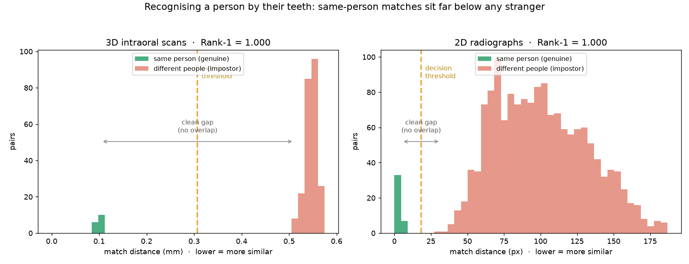
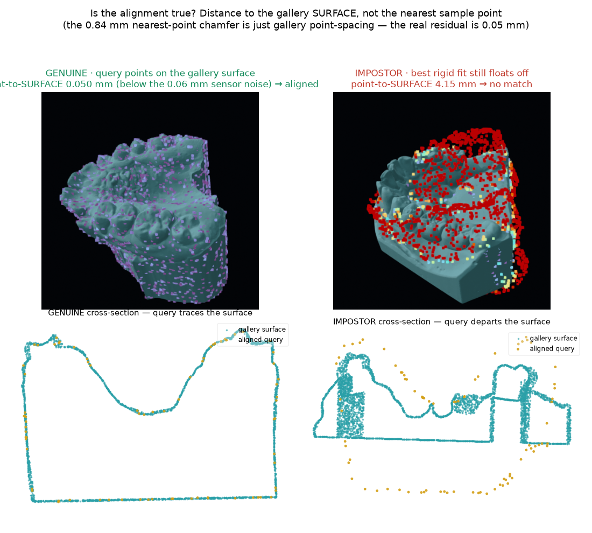
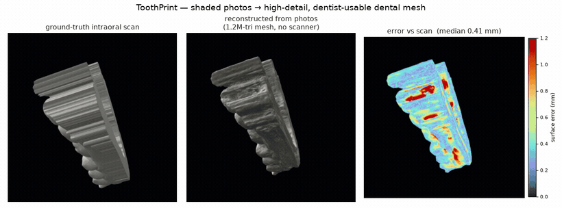
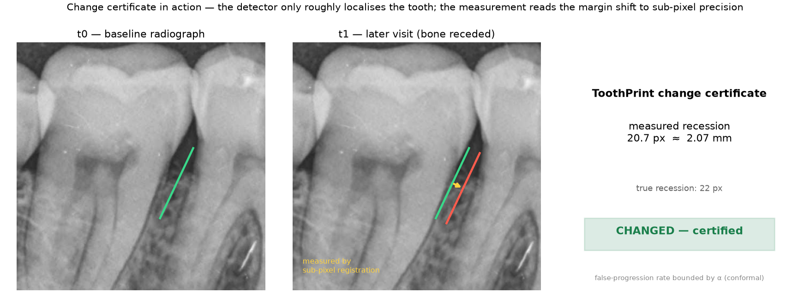
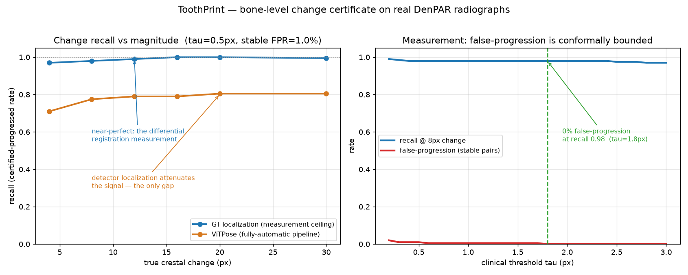
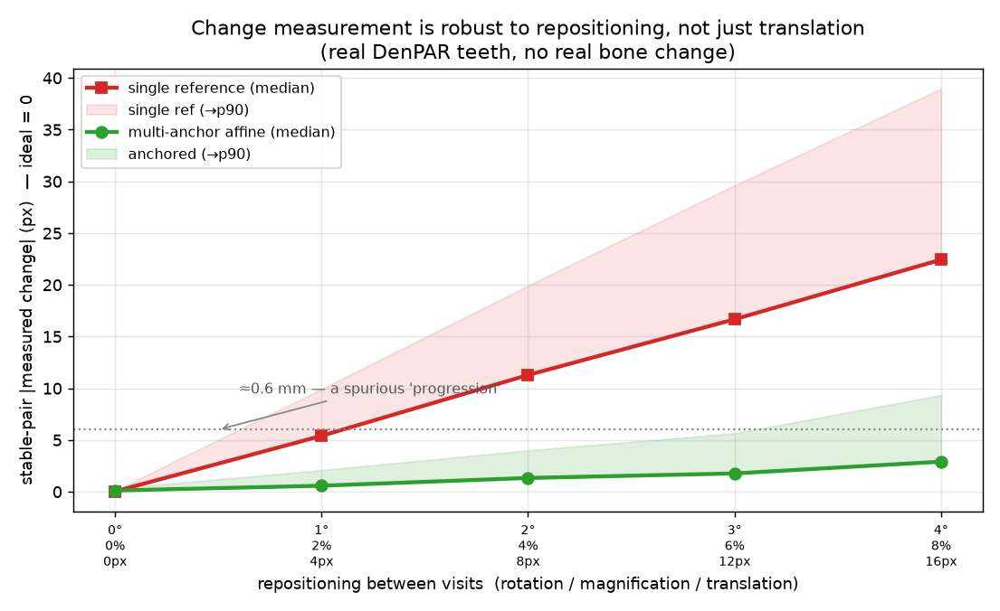
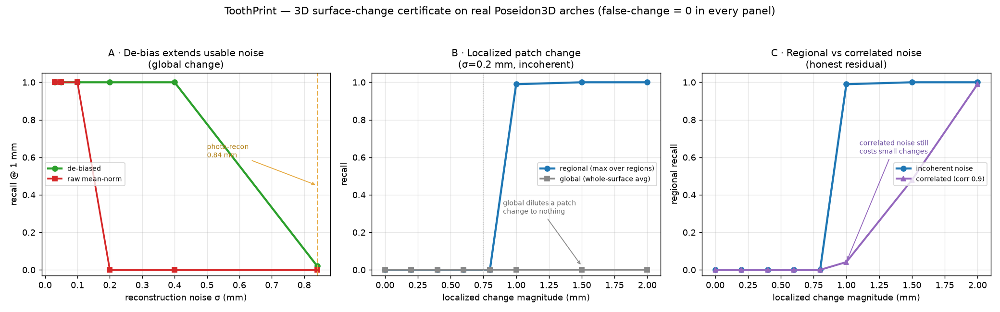

<div align="center">

# ToothPrint

**Certified dental-imaging intelligence — recognise a person by their teeth,
and certify what changed.**

`identity` · `change` · `surface` — three reads of one durable signal, each
returning a certificate instead of a guess.

</div>

---

A face can be lost; the teeth remain. ToothPrint reads the dentition three ways
and attaches a statistical guarantee to every verdict:

- **Who** is this? — dental biometric identification from a 3D scan or a 2D radiograph.
- **Whether** it changed — certified longitudinal bone-level change detection.
- **What** its surface is — certified 3D surface-change mapping.

The certification core depends only on `numpy`, `scipy`, `opencv`, and `open3d`.
Learned front-ends (tooth detection, Gaussian-splatting reconstruction) are
pluggable and optional, so the guarantees run without a GPU.

## Results (measured on real public data)

| Capability | What it answers | Result |
|---|---|---|
| **Identity — 3D scans** | Who is this arch? | **Rank-1 1.000** (N=50, EER 0, d′ 3.0), genuine ≤0.88 mm vs impostor ≥1.22 mm — *no overlap*, rigid best-fit (PCA-axis init + Generalized-ICP) |
| **Identity — 2D radiographs** | Who is this X-ray? | **Rank-1 1.000** (N=400, EER 0), robust to 20 px jitter (0.985) & 50% magnification |
| **Change certificate** | Did the bone level change? | measurement recall **0.98 @ 0% false-progression**; **0.81 end-to-end** (detector-limited) |
| **Surface certificate** | Did the 3D surface change? | **localized** change recall **0.99** (global avg gets 0.00), usable to **0.4 mm** recon noise, **0% false-change** |



Every certificate is conformal: it fires only when the interval around the
measurement lies entirely past the threshold, so the false-alarm rate is bounded
by α in finite samples — no distributional assumptions.

## Evidence on real data

These are the system's own outputs on the public Poseidon3D and DenPAR datasets.

**Identification** — a query re-scan is given its **best rigid alignment** to each
gallery arch (PCA principal-axis init + **Generalized-ICP** — a global init the
self-similar palate can't fool, rigid so no scale collapse), then overlaid as points
coloured by distance to the arch **surface**. For the **same person** the points sit
**on** the surface — blue, **0.05 mm from it**, below the scan noise — so the arch
looks dusted in blue; for a **stranger** the best fit still leaves the cloud
**floating off** the surface (red, **~4 mm**). You can see the query land on the
gallery, not just a score:


**Is the alignment actually true?** A genuine query's distance to the nearest gallery
*sample point* is ~0.8 mm — but that is just the gallery's point spacing, not a pose
error. Measured against the gallery *surface* (point-to-mesh), a correctly aligned
genuine re-scan collapses to **0.05 mm — below the 0.06 mm sensor noise**, while an
impostor's best rigid fit stays **~4 mm** off. The cross-section makes it visible: the
genuine query traces the gallery outline, the impostor departs it.



**Photos → a dentist-usable mesh** — no scanner? **3D Gaussian Splatting +
multi-view TSDF fusion** rebuilds a real arch from shaded photos into a watertight
**1.2 M-triangle mesh** (not a point cloud, not smoothed-away Poisson) that matches
the ground-truth scan to **0.42 mm median** — detailed enough for dental CAD. The
error heatmap (right) is mostly blue:



**Change measurement in action** — the detector only *roughly* localises the tooth
(coarse, on these large radiographs) — pinpoint landmarks aren't needed. The
certificate finds the bone-margin patch and reads the recession between two
timepoints by **sub-pixel registration** (here 20.7 px measured vs 22 px true),
then certifies it conformally:



**Change certificate** — measuring the bone-level shift *differentially* (sub-pixel
registration of the margin between timepoints, not by re-detecting landmarks) is
near-perfect: recall climbs to **1.0** with false-progression conformally bounded,
and still holds **0.98** even when the threshold is set so false-progression is a
true **0**. The only gap is the fully-automatic pipeline, where the detector's
coarse localization attenuates the signal — an honest, isolated, data-label limit,
not a flaw in the certificate:



**Robust to repositioning** — between visits a patient is re-seated at a different
angle and distance, so the radiograph is rotated and magnified, not just shifted. A
single crown reference only cancels a translation; a **multi-anchor affine** model
cancels the full motion. On real teeth with *no* real bone change, that drops the
spurious "change" ~8× — keeping a repositioning artifact from firing the certificate:



**Surface certificate** — the displacement is measured *differentially* and
**de-biased** (the naive mean-of-distances rectifies reconstruction noise into a
false signal; subtracting the noise power removes it), which extends the usable
reconstruction noise from 0.1 mm to **0.4 mm**. It is also **regional**: a real
lesion moves a *patch*, which a whole-surface average dilutes to nothing (recall
**0.00**) — a per-region max statistic recovers it (**0.99**) and says *where* it
is, with the conformal false-change rate still **0** (the max is calibrated on
stable pairs). The honest residuals are shown too — heavy correlated noise still
costs small changes. (The new high-detail mesh reconstruction reaches **0.42 mm
median**, right at this certificate's usable-noise edge — a big step from the old
0.84 mm point cloud — though its error *mean* of ~0.6 mm still favours an IOS scan):



## How it works

One stack, three certificates:

```
scan / radiograph ─▶ detect ─▶ register ─▶ certify
                     teeth +    2D/3D ICP ·  conformal interval ─▶ identity
                     landmarks  FPFH ·        ─▶ change
                     or cloud   template      ─▶ surface
                                matching
```

- **Identity (3D):** give the query its *best rigid alignment* to each gallery arch
  (PCA principal-axis init → multi-scale **Generalized-ICP**, rigid so no scale
  collapse), then pick the arch with the smallest mean surface distance — fair to
  every candidate, so the score is shape, not pose (`identity.align_rigid` /
  `identify_surface`). Feature-based global registration (FGR) was evaluated and
  rejected: the self-similar palate makes FPFH features ambiguous, dropping Rank-1
  to 0.62 — the shape-driven principal-axis init is both reliable and fair.
- **Identity (2D):** the per-tooth landmark constellation, scale-normalised so
  magnification cancels, aligned by rigid ICP.
- **Change:** the bone-level shift is measured *differentially* — sub-pixel
  template matching of the margin between timepoints, referenced to **multiple
  stationary crown anchors fitted to an affine motion model** so acquisition
  repositioning (translation, rotation, *and* projection magnification) cancels —
  then certified conformally.
- **Surface:** scale-aware ICP + screened-Poisson refinement, then a *de-biased*
  differential displacement (subtract the reconstruction-noise power so zero-mean
  noise isn't rectified into a false signal), measured *per region* so a localized
  lesion isn't diluted — the max region is certified conformally (calibrated on the
  max, so the false-change rate stays bounded) and tells you where it changed.

## Use it

```python
import numpy as np
from toothprint.identity import identify_surface, identification_metrics
from toothprint.change import ConformalCertifier, certify_change, bone_vector
from toothprint.surface import surface_error, certify_surface_change

# Identify a person from a 3D arch against a gallery — each candidate gets the
# query's best rigid fit (PCA-axis init + Generalized-ICP); smallest mean surface
# distance wins, so the score is shape, not pose.
distances = identify_surface(query_points, gallery_scans, voxel_size=0.5)
person = labels[int(np.argmin(distances))]

# Certify a surface change against calibrated reconstruction noise
certifier = ConformalCertifier.fit(measured_stable, true_stable, alpha=0.1)
verdict = certify_surface_change(measured_mm=1.2, certifier=certifier)   # -> "changed"
```

## Run the app

A web console for the three certificates, plus a JSON API.

```bash
pip install -e ".[api]"
uvicorn api.main:app --reload      # http://localhost:8000
```

| Endpoint | Does |
|---|---|
| `POST /api/identify/radiograph` | Match a landmark constellation against a gallery |
| `POST /api/certify/change` | Certify a radiograph bone-level change |
| `POST /api/certify/surface` | Certify a 3D surface change |

The frontend (`web/`) is a static, dependency-free single page — open it directly
or let the API serve it.

## Layout

```
toothprint/
  toothprint/        the library — identity · change · surface (100% covered)
  api/               FastAPI service
  web/               the console (HTML/CSS/JS, no build step)
  docs/              result figures
  tests/             100 tests, 100% coverage
```

## Test

```bash
pip install -e ".[dev]"
pytest --cov=toothprint --cov=api      # 100%
```

## Clinical deployment & readiness

ToothPrint is a **validated research prototype, not a cleared medical device.** A
`toothprint.clinical` layer provides the deployment-engineering a clinical
setting needs — **site recalibration** of the conformal layer (the α guarantee
only transfers if you recalibrate on your own data), **input quality gates**
(refuse unusable captures), **first-class abstention**, and an **append-only
audit trail**. Governance docs spell out the rest honestly:

- [MODEL_CARD.md](MODEL_CARD.md) — intended use, out-of-scope use, performance, ethics
- [RISK.md](RISK.md) — ISO 14971-style hazard analysis
- [CLINICAL_READINESS.md](CLINICAL_READINESS.md) — what is done vs the regulatory gate
- [evaluation/REPORT.md](evaluation/REPORT.md) — full ablated evaluation + verdict

**Bottom line:** the methods are sound and the false-alarm guarantee is real, but
real-world clinical use still requires longitudinal/cross-session data, a
prospective study, and FDA/CE clearance — none of which can be produced from code.

## Provenance & limits

Numbers are measured on the public Poseidon3D (intraoral scans) and DenPAR
(radiographs) datasets with **synthetic** perturbations (single-timepoint data —
read the headline metrics as optimistic ceilings); reproduction scripts and the
underlying research live in the companion repositories. Datasets and model
checkpoints are never committed.

## License

MIT.
