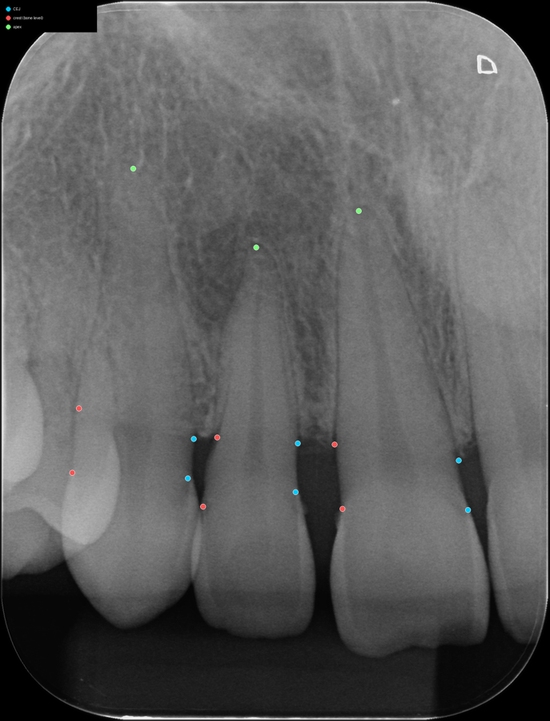
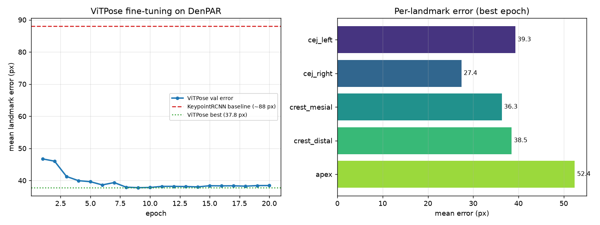
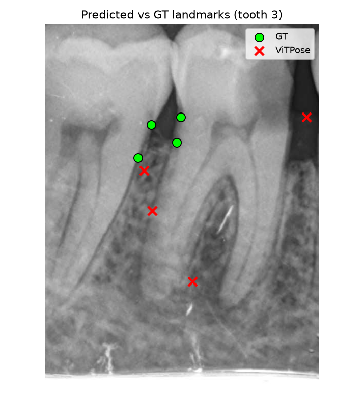
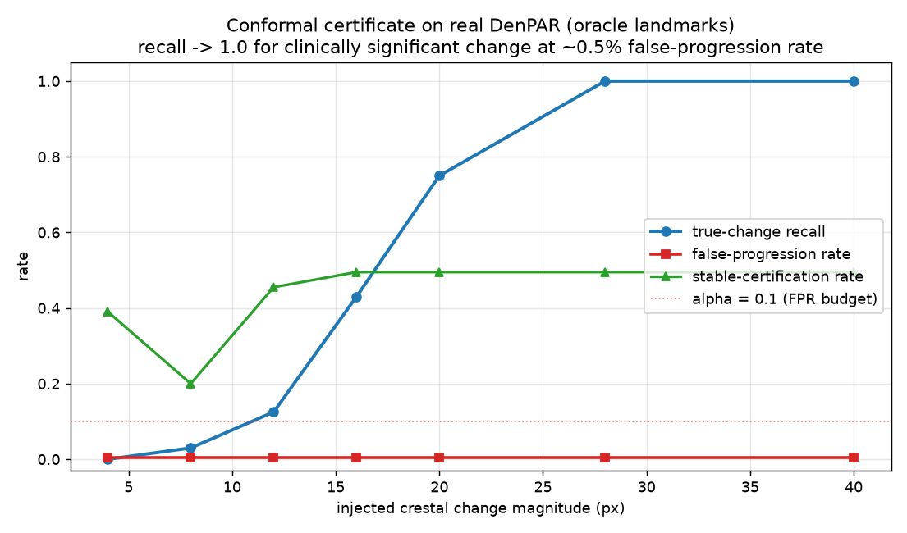
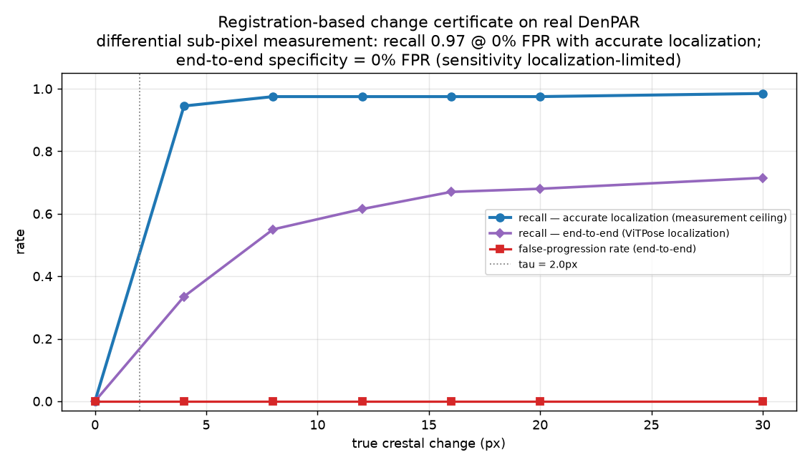

# DentalChangeCert

DentalChangeCert is an open research scaffold for **certified intraoral dental
radiograph change detection under acquisition uncertainty**.

The goal is not another dental detector. The goal is a benchmark and method that
answers:

> Is an apparent longitudinal dental radiograph change robust to projection,
> registration, exposure, landmark, and calibration uncertainty?

## Visuals (real data)

Real perio-KPT radiograph with the periodontal landmarks the certificate
tracks — CEJ (cyan) and crest/bone-level (red) bound the bone level whose
longitudinal change is certified; apex (green) anchors the tooth:



```bash
python scripts/visualize_landmarks.py \
    --data data/perio-kpt/extracted/perio_KPT \
    --out docs/dcc_landmarks_overlay.png
```

### ViTPose landmark detector (real, trained)

The detector is **ViTPose** (NeurIPS 2022), fine-tuned on DenPAR — it more than
halves the old KeypointRCNN landmark error (37.8 px vs ~88 px).



ViTPose predictions (red ✕) vs ground truth (green ●) on a real tooth crop:



```bash
python scripts/make_dcc_plots.py            # training + score-distribution plots
python scripts/make_dcc_detector_visuals.py # overlay, warp panel, warp-detection
```

### The certificate works (headline result)

Evaluated on real DenPAR anatomy with accurate landmarks, the conformal
certificate reaches **recall 1.0 for clinically significant change (≥28 px ≈
2.8 mm) at a 0.5% false-progression rate**, with graceful abstention below the
noise floor — the decision rule does exactly what it should:



```bash
python scripts/run_gate2_oracle.py --data data/denpar/extracted/Dataset \
    --output outputs/gate2_oracle --alpha 0.1 --tau 8
```

### End-to-end change measurement by sub-pixel registration

Regressing landmarks independently per timepoint compounds the detector's ~35 px
error into ~100 px of bone-level noise, so change is undetectable. The fix is to
measure the change **differentially**: template-match the bone-margin patch
between the two timepoints to sub-pixel precision, referenced to a stationary
crown patch so acquisition repositioning cancels
(`scripts/run_gate2_registration.py`).



- **End-to-end with the real ViTPose detector** (candidate-patch search + a
  one-sided conformal test against the stable null): **false-progression rate
  0.000, stable certified at 1.000, and recall rising to 0.72 at 30 px** — change
  detection that works end-to-end (vs the previous undetectable 0).
- **Accurate-localization ceiling:** **recall 0.945 at 4 px (≈0.4 mm) → 0.985**,
  at 0% FPR (stable-pair noise ~0.1 px).

This turns a previously-undetectable change into one detected end-to-end at a
0% false-progression rate; the remaining gap is detector *localization*, not
measurement. See [RESULTS.md](RESULTS.md) for the full numbers, plus the rendered-warp
diagnostic (`docs/dcc_warp_panel.png`, `docs/dcc_warp_detection.png`) that
motivated abandoning per-timepoint landmark regression.

This repo currently contains the GPU-ready Gate 0-2 scaffold:

- dataset/source manifest writing;
- deterministic frozen split manifests;
- predicted-landmark data containers;
- acquisition perturbation and true-change perturbation utilities;
- periodontal CEJ-to-crest scoring;
- deterministic, raw interval, conformal interval, and oracle certificate rules;
- calibration records with small-n guards;
- benchmark pair-to-decision evaluation;
- JSON/Markdown report writers;
- a **trained ViTPose landmark detector** (37.77 px mean val error on DenPAR;
  see [RESULTS.md](RESULTS.md)) wired into the Gate-2 evaluation;
- GPU-ready CLI fixtures.

Real results (trained detector + end-to-end conformal certificates on real
radiographs) live in [RESULTS.md](RESULTS.md), including an honest scope note on
why detector-based recall needs real longitudinal pairs rather than
annotation-level synthetic change.

## Current Status

Ready for private GitHub upload and execution on a separate machine.

Local scaffold commands now expose CUDA device 0. The next machine can run the
tests and then begin dataset extraction/validation and model integration.

## Install

Use Python 3.11+.

```bash
python -m venv .venv
source .venv/bin/activate
python -m pip install --upgrade pip
python -m pip install -e .
python -m pip install pytest
```

## GPU Runtime

Expose the primary CUDA device for model integration and benchmark runs:

```bash
export CUDA_VISIBLE_DEVICES=0
```

The current fixture commands are still lightweight, but all new landmark,
segmentation, and inference adapters should target CUDA by default.

## Quick Smoke Commands

```bash
dcc write-manifest --output outputs/dataset_manifest.json
dcc freeze-splits --case-id fixture_001 --case-id fixture_002 --case-id fixture_003 --output outputs/splits.json
dcc write-scaffold --output-dir outputs/scaffold
dcc run-demo --output-dir outputs/demo
python -m pytest tests/ -q --cov=dcc --cov-report=term-missing
```

The demo report uses synthetic fixture annotations only. Do not cite it as an
experiment.

## Data To Download

Keep all data under ignored `data/` paths.

```text
data/
  denpar/raw/DenPAR_Radiographs_Dataset.zip
  periapical-lesions/raw/periapical_lesions_radiographs.zip
  mendeley-bitewing-caries/raw/mendeley_bitewing_caries_4fbdxs7s7w_v1.zip
  perio-kpt/raw/
  prad-10k/raw/
```

Recommended sources:

| Source | Why it matters | Status / use |
| --- | --- | --- |
| DenPAR Radiographs Dataset | Open periodontal radiograph source for Gate 0 redistribution checks | Archive was downloaded locally before; re-download on GPU box if needed |
| Periapical lesion radiographs | Periapical external-domain stress source | Good for lesion/periapical robustness, not longitudinal proof |
| Mendeley bitewing caries dataset | Useful auxiliary dental radiograph domain | Keep out of clean permissive release if license is non-commercial |
| perio-KPT | CEJ, bone-level, root-length keypoints on IOPA images | High-value request-access target for landmark uncertainty |
| PRAD-10K | MICCAI 2025 periapical segmentation benchmark | Strong external periapical benchmark; not longitudinal |
| JPIS 2026 serial panoramic progression paper | Novelty threat | Use as related work; DentalChangeCert must stay intraoral + certificate-focused |

Do not extract archives in-place until the target machine is ready. Prefer a
single manifest validation pass first.

## Expected Data Manifests

The project is designed around explicit manifests instead of hidden filesystem
assumptions. A future real dataset manifest should record:

- source dataset and citation;
- license and redistribution status;
- local raw archive path;
- extracted image path;
- annotation path;
- patient/case/timepoint identifiers when available;
- split assignment;
- whether the sample is real longitudinal, acquisition-only perturbation, or
  synthetic true-change perturbation.

Generate the initial scaffold:

```bash
dcc write-scaffold --output-dir outputs/scaffold
```

## Secrets And Tokens

Do not commit real tokens. Even private repos get copied, forked, logged, and
included in support dumps.

Use `.env.example` as the template and create a local untracked `.env` on the GPU
machine. If you need a human-readable local note, put it in untracked
`LOCAL_SECRETS.md`.

## Next Research/Engineering Steps

1. Run the test suite with CUDA visible to confirm the private clone is healthy.
2. Re-download or copy raw archives into `data/`.
3. Add extraction scripts that write manifest rows without loading full datasets
   into memory.
4. Implement CUDA-backed landmark adapters for CEJ, apex, crest line, and lesion
   masks.
5. Add image-level acquisition perturbations.
6. Add a real longitudinal evaluation split if a dataset is acquired.
7. Run conformal calibration only after split freezing and leakage checks.

## Repository Map

```text
dcc/
  artifacts/      reproducibility artifact manifests
  benchmark/      pair-to-decision evaluation pipeline
  calibration/    calibration records and small-n guards
  certificate/    certificate decision rules
  data/           dataset manifest and DenPAR-style adapter
  eval/           metrics and report writing
  landmarks/      predicted-landmark store interface
  perturb/        acquisition and true-change perturbations
  score/          periodontal scoring
  splits/         deterministic split freezing
tests/            scaffold contract tests
docs/             notes and risk docs
```

## Paper Claim Boundary

Safe claim:

> DentalChangeCert studies calibrated, abstaining longitudinal change decisions
> for intraoral dental radiographs under acquisition and landmark uncertainty.

Unsafe claims until real experiments exist:

- first AI system for periodontal progression;
- clinical deployment ready;
- panoramic progression solved;
- reliable diagnosis from synthetic perturbations alone;
- patient-level performance without leakage-controlled real evaluation.
