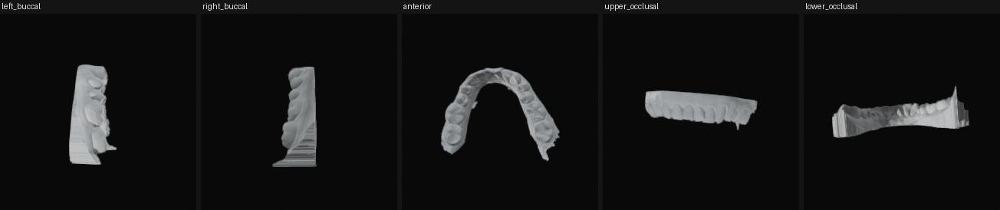
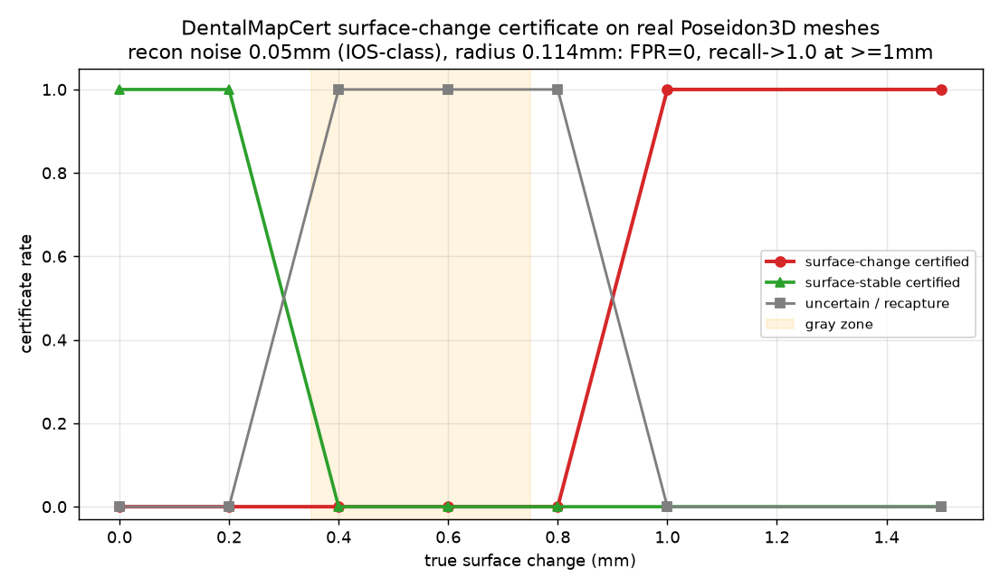
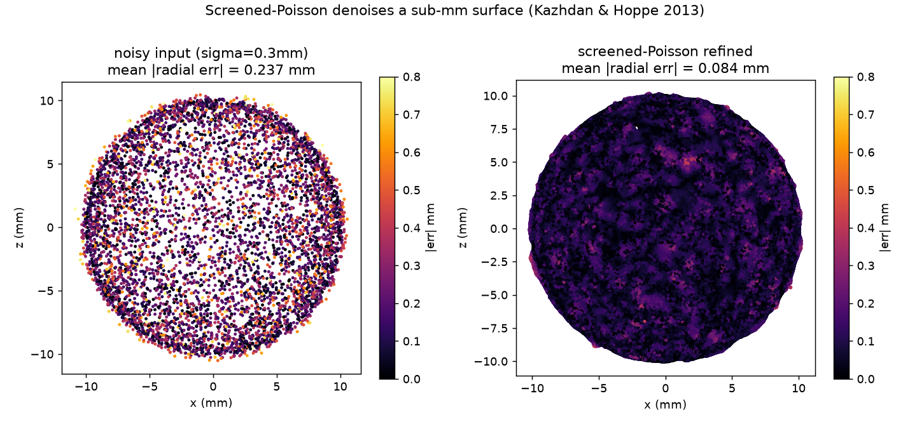
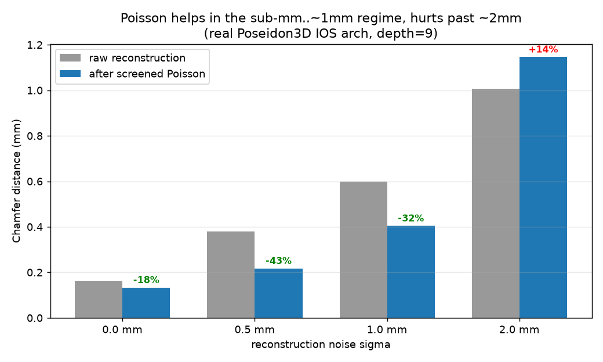
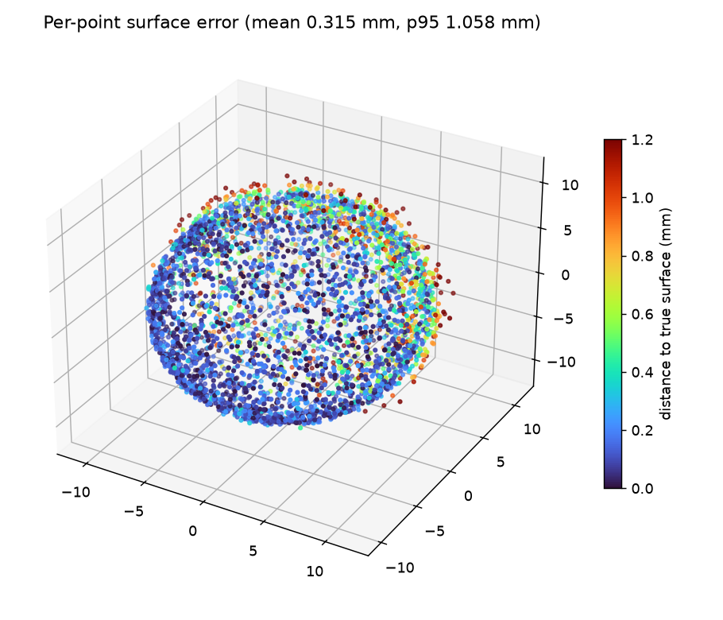
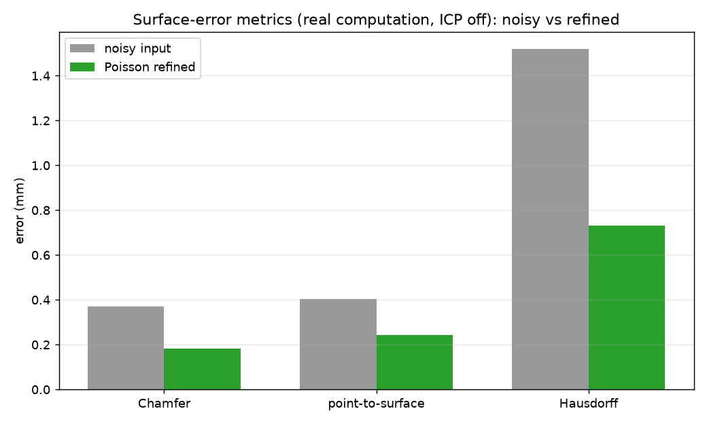

# DentalMapCert

DentalMapCert is a research system for **coverage-certified smartphone oral
surface mapping** from guided photos or short video.

The goal is not simply to reconstruct teeth. The goal is to produce a visible
surface map with a trust layer:

> Which tooth/gingiva surface regions are visible, stable, changed, uncertain,
> or need recapture?

This is the companion visible-surface track to DentalChangeCert.

## Visuals (real data)

The 5 protocol views rendered from a real Poseidon3D dental mesh (Open3D
offscreen renderer) — the input to the reconstruction chain:



```bash
python scripts/render_mesh_views.py \
    --mesh data/poseidon3d/extracted/data/000062/000062_MODEL_mandible.stl \
    --out docs/dmc_5view_render.png
```

### The certificate works (headline result)

On real Poseidon3D dental surfaces with IOS-class reconstruction noise, the
conformal surface-change certificate **certifies stability for ≤0.2 mm, certifies
change for ≥1.0 mm, and abstains in the gray zone — at a 0% false-change rate**:



```bash
python scripts/run_dmc_certificate_oracle.py \
    --data data/poseidon3d/extracted/data --recon-noise-mm 0.05
```

The DUSt3R neural backend also runs end-to-end on an 8 GB RTX 4060
(`--backend dust3r`), with scale-aware similarity alignment for the
scale-ambiguous reconstruction. See [RESULTS.md](RESULTS.md).

### Screened-Poisson surface refinement

Screened Poisson (Kazhdan & Hoppe 2013) denoises an oriented point cloud. On a
sub-mm surface it roughly halves the mean radial error:



It is **not** a universal win — validated on a real Poseidon3D IOS arch, Poisson
helps in the sub-mm..~1 mm regime and *hurts* past ~2 mm (over-smoothing):



### Surface-error metrics

The certificate's error radius is driven by real point-cloud surface error
(Chamfer / point-to-surface / Hausdorff, ICP-aligned). Per-point error and the
aggregate metrics, noisy input vs Poisson-refined:




```bash
python scripts/make_dmc_plots.py   # all four plots above (CPU only)
```

See [RESULTS.md](RESULTS.md) for the validated Poisson sweep and the conformal
certificate numbers. Absolute end-to-end reconstruction error depends on the
neural backend (VGGT/DUSt3R), which requires a GPU with sufficient VRAM.

## What Is Implemented

### 3D Reconstruction Pipeline (`src/dentalmapcert/reconstruction.py`)

A backend-selectable reconstruction chain. `backend` defaults to `vggt` (the
metric neural default) and cascades to weaker backends only when a stronger one
is unavailable, so the crude CPU fallback is never a silent first choice:

1. **VGGT** (`facebook/VGGT-1B`, Meta FAIR CVPR 2025) — single forward pass
   from unposed images; no SfM required. **Needs a GPU** (e.g. the 2x RTX 5090,
   32 GB each, target hardware); implemented, pending a GPU run.
2. **DUSt3R** via `mini-dust3r`
   (`nielsr/DUSt3R_ViTLarge_BaseDecoder_512_dpt`) — pairwise-stereo global
   alignment.
3. **Open3D Canny-edge fallback** (`backend="open3d"`) — CPU-only, no model
   weights; projects detected image edges into 3-D using assumed pinhole
   geometry and voxel-downsamples with Open3D. **Crude / uncalibrated**: this is
   not a metric reconstruction and is a deliberate choice, not a default.

All three backends share the same public API:

```python
from dentalmapcert.reconstruction import reconstruct_point_cloud
points_xyz, confidence = reconstruct_point_cloud(
    image_paths, device="auto", backend="vggt"
)
# points_xyz: np.ndarray (N, 3).
#   - Open3D fallback returns MILLIMETRES (matches coverage / surface_error).
#   - VGGT / DUSt3R return native/up-to-scale units; rescale to mm for metric error.
# confidence: np.ndarray (N,), in [0, 1]
```

### Adaptive Voxel-Grid Coverage Estimation (`src/dentalmapcert/coverage.py`)

Estimates what fraction of a 3-D bounding box is covered by a point cloud
using Open3D voxel downsampling. The voxel resolution adapts to cloud density
(5×5×5 for sparse, 10×10×10 for medium, 20×20×20 for dense). Coverage is
capped at 0.95 to reflect measurement uncertainty.

```python
from dentalmapcert.coverage import coverage_from_point_cloud
score = coverage_from_point_cloud("region_id", points, region_bbox)
# score.coverage_fraction in [0.0, 0.95]
```

### 5-View Dental Protocol (`src/dentalmapcert/capture_protocol.py`)

Standard five-view capture: `anterior_close`, `left_buccal`, `right_buccal`,
`upper_occlusal`, `lower_occlusal` (`STANDARD_PROTOCOL`). The manifest schemas
for case, capture, view, and surface-region live in
`src/dentalmapcert/schemas.py`.

### Conformal Certificate (`src/dentalmapcert/certificate.py`)

Visible-surface certificate decisions with calibrated coverage and
uncertainty intervals.

### Longitudinal Pairing (`src/dentalmapcert/longitudinal.py`)

Pairs records by subject ID across timepoints for change tracking
(`pair_by_subject`).

### Dataset Loaders (`src/dentalmapcert/dataset_loaders.py`)

| Loader class | Dataset |
|---|---|
| `Teeth3DSLoader` | Teeth3DS reference dental OBJ meshes (Grand Challenge) |
| `PhoneCaptureLoader` | Project-owned smartphone captures |
| `Poseidon3DLoader` | Poseidon3D STL meshes (Zenodo 15608906) |
| `TeethLandLoader` | 3DTeethLand landmark JSON files |

All loaders expose a `records()` iterator and `validate_paths()` method.

## What Is NOT Yet Done

- **M1 benchmark numbers**: VGGT and DUSt3R have not yet been run on real
  dental photography. No benchmark figures exist yet.
- **Teeth3DS OBJ meshes**: The OBJ mesh files require Grand Challenge
  registration at <https://teeth3ds.grand-challenge.org/>. Only 3DTeethLand
  landmark JSON files are available locally (`data/teeth3ds/extracted/`).
  `Teeth3DSLoader` will report a clear error via `validate_paths()` when the
  `obj/` directory is missing.
- **CUDA required for neural backends**: VGGT and DUSt3R require a GPU and the
  optional `vggt` / `mini-dust3r` packages. The Open3D fallback runs on CPU
  but produces only edge-based geometry, not a true surface reconstruction.

## Install

Use Python 3.11+.

```bash
python -m venv .venv
source .venv/bin/activate
python -m pip install --upgrade pip
pip install -e .                           # core only (numpy, scipy, pillow)
pip install -e ".[vision]"                 # adds opencv-python-headless, torch
pip install -e ".[mesh]"                   # adds open3d
pip install -e ".[vggt]"                   # adds vggt
pip install -e ".[dust3r]"                 # adds mini-dust3r
pip install -e ".[full]"                   # all of the above
pip install -e ".[dev]"                    # pytest for testing
```

## GPU Runtime

```bash
export CUDA_VISIBLE_DEVICES=0
```

VGGT and DUSt3R target CUDA by default. `_resolve_device("auto")` selects
CUDA when `torch.cuda.is_available()` and falls back to CPU otherwise.

## Quick Start

```bash
dentalmapcert write-scaffold --output-dir outputs/scaffold
dentalmapcert run-demo --output-dir outputs/demo
python -m pytest
```

## Data

```text
data/
  teeth3ds/
    extracted/         3DTeethLand landmark JSON files (available)
    obj/               Teeth3DS OBJ meshes (requires Grand Challenge access)
  poseidon3d/
    extracted/data/    Poseidon3D STL meshes (downloaded from Zenodo 15608906)
  phone-captures/raw/  Project-owned smartphone captures
```

## Benchmark Scope

DentalMapCert will evaluate:

- visible surface coverage;
- surface-region error intervals;
- whether longitudinal change is stable or uncertain;
- whether recapture guidance points to the missing views;
- robustness under blur, glare, partial mouth opening, tongue/cheek occlusion,
  saliva, orthodontic hardware, and lighting variation.

## Repository Map

```text
src/dentalmapcert/
  baselines.py      baseline coverage/decision comparators
  calibration.py    calibration containers
  capture_protocol.py 5-view STANDARD_PROTOCOL and per-region coverage
  certificate.py    visible-surface certificate rules
  cli.py            scaffold/demo CLI
  coverage.py       adaptive voxel-grid coverage estimation
  dataset_loaders.py  Teeth3DS, PhoneCapture, Poseidon3D, TeethLand loaders
  eval_metrics.py   benchmark/ROC evaluation metrics
  fusion.py         summaries for DentalChangeCert fusion
  image_quality.py  capture image-quality checks (blur/glare/occlusion)
  longitudinal.py   longitudinal pairing by subject
  perturbations.py  input perturbation utilities
  reconstruction.py VGGT → DUSt3R → Open3D fallback pipeline
  regions.py        FDI tooth/region taxonomy helpers
  render.py         rendering helpers
  report.py         Markdown/JSONL outputs
  schemas.py        manifests for cases, captures, views, regions
  surface_error.py  ICP + Chamfer/Hausdorff surface error
tests/              fixture and unit tests
docs/               GPU baseline, dataset, and handoff docs
```

## Safe Claim Boundary

Safe claim:

> DentalMapCert studies whether phone-guided oral photos/video can produce
> visible-surface maps with calibrated coverage, uncertainty, and recapture
> guidance.

Unsafe claims until real experiments exist:

- complete 3D oral model from any phone video;
- hidden/root/subgingival anatomy reconstruction;
- diagnosis from surface video alone;
- clinical-grade monitoring without dentist validation;
- superiority to intraoral scanners.
